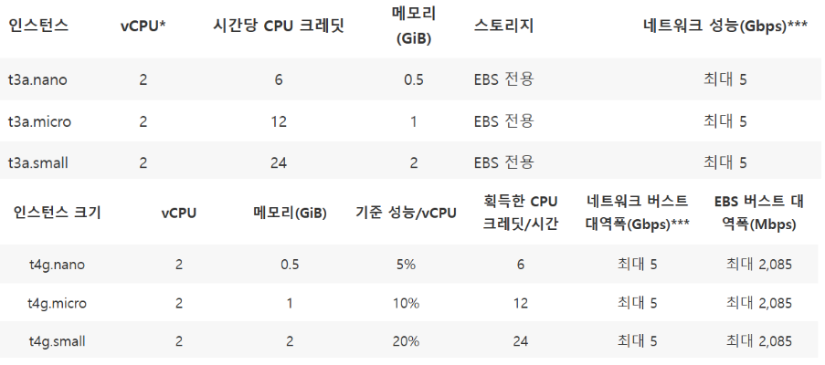
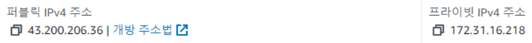
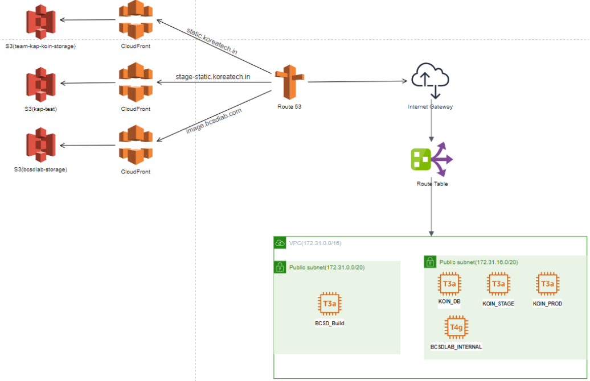

## AWS
AWS란 아마존에서 제공하는 클라우드 컴퓨팅 서비스이다. 현재 코인은 AWS에서 인프라를 운영하고 있다.

## EC2
EC2(인스턴스) 란 AWS에서 제공하는 클라우드 컴퓨터로 비용에 맞는 성능과 저장공간을 가질 수 있다.

현재 코인은 서울 리전에서 아래와 같은 5개의 인스턴스를 운영중이다.

인스턴스는 각각의 성능과 비용을 갖는 인스턴스 유형을 고를 수 있는데 현재 코인은 5개 중 4개는 t3a.small을 사용하고 있으며, 나머지 1개는 t4g.small을 사용하고 있다.
>

t3a와 t4g는 워크로드가 기준 임계값 미만에서 작동할 때 CPU 크레딧을 누적하고 기준 임계값 이상으로 실행될 때 크레딧을 사용하는 방식으로 이뤄진다. 그렇기때문에 평소와 달리 일시적으로 많은 성능이 필요할때 버스트를 사용할 수 있어, 저렴한 가격으로 필요한 상황에서 높은 성능을 가질 수 있다.

t4g는 t3a보다 가격대비 더 높은 성능을 내지만, 범용적으로 쓰이는 프로세서가 아니다. 즉, t3a처럼 대부분의 애플리케이션과 호환할 수 있는 일반적인 AMD x86 아키텍처 기반이 아니라 ARM 아키텍처 기반이므로 일부 애플리케이션이 ARM 아키텍처를 지원해야한다.

현재 코인은 아래와 같은 EC2를 운영하고 있다.

- BCSD_Build 인스턴스
  퍼블릭 IPv4 주소 : 13.209.141.183
  인스턴스 유형 : t3a.small

- BCSDLAB_INTERNAL 인스턴스
  퍼블릭 IPv4 주소 : 43.202.254.112
  인스턴스 유형 : t4g.small

- KOIN_STAGE 인스턴스
  퍼블릭 IPv4 주소 : 43.200.206.36
  인스턴스 유형 : t3a.small

- KOIN_PROD 인스턴스
  퍼블릭 IPv4 주소 : 52.78.46.60
  인스턴스 유형 : t3a.small

- KOIN_DB 인스턴스
  퍼블릭 IPv4 주소 : 54.180.57.106
  인스턴스 유형 : t3a.small

## VPC & 서브넷
AWS 클라우드에서 논리적으로 격리된 가상 네트워크 환경이다. VPC별로 네트워크를 구성할 수 있고 각각의 VPC에따라 다르게 네트워크 설정을 줄 수 있어 완전히 독립된 네트워크처럼 작동할 수 있게된다. 그리고 서브넷은 해당 VPC네트워크를 더 세분화하여 VPC보다 더 작은 범위의 아이피값을 갖게 해주며 VPC보다 더 우선적인 네트워크를 갖게 해준다.

VPC와 서브넷에 대한 설정중 CIDR과 NACL이 있다. CIDR같은 경우는 IP주소 범위를 뜻하고, NACL은  서브넷 수준에서 트래픽을 제어하는 방화벽 규칙으로, 인바운드(외부에서 내부 네트워크로 들어오는 트래픽)과 아웃바운드(내부 네트워크에서 외부로 나가는 트래픽) 트래픽을 허용 또는 거부할 수 있다.

현재 코인은 아래와 같이 1개의 VPC와 4개의 서브넷을 갖고 있다.

### VPC(BCSDLab)
IPv4 CIDR : 172.31.0.0/16
IP 주소 범위 : 172.31.0.0~172.31.255.255

### 서브넷
IPv4 CIDR : 172.31.0.0/20
IP 주소 범위: 172.31.0.0 ~ 172.31.15.255
NACL : 모든 트래픽 허용

IPv4 CIDR : 172.31.16.0/20
IP 주소 범위: 172.31.16.0 ~ 172.31.16.255
NACL : 모든 트래픽 허용

IPv4 CIDR : 172.31.32.0/20
IP 주소 범위:  172.31.32.0 ~ 172.31.47.255
NACL : 모든 트래픽 허용

IPv4 CIDR : 172.31.48.0/20
IP 주소 범위: 172.31.48.0 ~ 172.31.63.255
NACL : 모든 트래픽 허용

## 퍼블릭 IP주소와 프라이빗 IP주소

AWS의 인스턴스를 보면 퍼블릭 IPv4 주소와 프라이빗 IPv4 주소가 있다.

퍼블릭 IP주소는 외부에서 인스턴스에 직접 접속하거나, 인터넷 상의 다른 서비스와 통신할 때 사용된다. 인스턴스를 재시작하면 IP가 변경되는데, 탄력적 IP주소를 이용하면 고정할 수 있다.

프라이빗 IP주소는 VPC내에서만 사용되는 IP 주소이다. 프라이빗 IP주소를 통해 동일 VPC 내의 다른 인스턴스나 서비스하고 통신할 때 사용된다.

## S3
AWS에서 안전하고 내구성 있는 객체 스토리지 서비스를 제공해주는 기능이다.

현재 코인에선 아래와 같이 3개의 S3를 운영하고 있다.

- bcsdlab-storage
  객체 : images/

- kap-test

- team-kap-koin-storage

## CloudFront(CDN)
콘텐츠 전송 네트워크(CDN)는 대용량 파일을 빠르게 로드하여 웹 페이지 로드 속도를 높이는 상호 연결된 서버 네트워크이다. 사용자와 가까운 CDN 서버에 저장되며 컴퓨터에 훨씬 빨리 도달할 수 있게된다.

현재 코인은 아래와 같이 3개의 대체 도메인에서 사용되고있다.

ID : E1QROAB9PHO2Z
대체 도메인 : static.koreatech.in

ID : EI7PAG7MZZBP1
대체 도메인 : stage-static.koreatech.in

ID : E2VEMNBL5U83LM
대체 도메인 : image.bcsdlab.com

## Route 53
Route53은 AWS에서 제공하는 DNS이다. 호스팅 영역이 있으며, 호스팅 영역 내에 레코드가 있다. 호스팅 영역은 특정 도메인에 대한 DNS 설정을 관리하는 컨테이너이다. 레코드는 호스팅 영역 내에서 도메인에 대한 특정 DNS 정보를 정의한다. 각 레코드는 도메인 이름을 IP 주소로 라우팅 할 수 있게한다.

현재 코인은 3개의 퍼블릭 호스팅 영역이 있으며, 2개가 등록된 상태이다.

bcsdlab.com (등록된 도메인)

koreatech.in (등록된 도메인)

jjbaksa.com

## 보안그룹
보안 그룹은 인스턴스 수준에서 트래픽을 제어하는 방화벽으로 인스턴스에 대한 들어오는 트래픽(인바운드 규칙)과 나가는 트래픽(아웃바운드 규칙)을 제어할 수 있다.

코인에서 BSCD_Build같은 인스턴스같은 경우는 Web, SSH, DockerSwarm보안그룹에 있는 인바운드 규칙을 선택적으로 정의하여 외부에서 BCSD_Build 인스턴스에 접근하기 위한 포트를 허용하고 있다.

## 보안그룹과 NACL 차이점
트래픽을 제어한다는 관점에서 둘이 유사하지만 적용범위가 다르다.
보안그룹은 서버 단위이고, NACL은 서브넷 단위이다.  
서브넷이 다르거나 외부와의 통신의 경우 보안그룹과 NACL을 모두 거쳐야 하고, 서브넷이 같을 경우 보안그룹만 거치게된다.

## 현재 코인 AWS 대략적인 흐름

