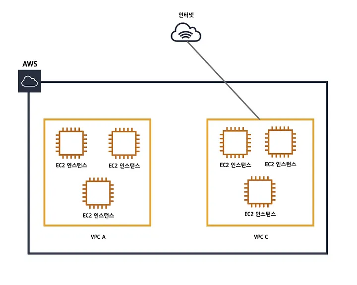
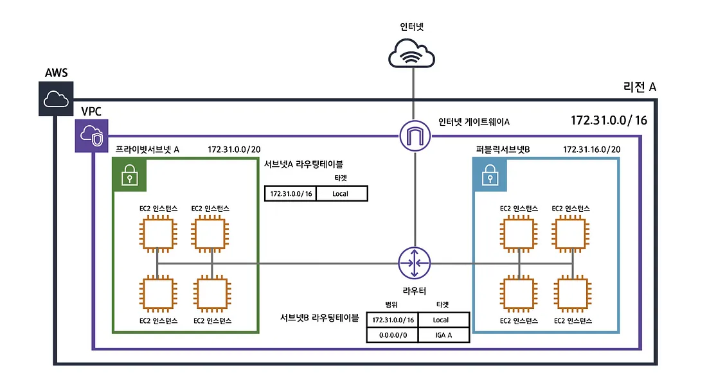

# 1주차

## EC2(**Elastic Compute Cloud**)

- **아마존 웹 서비스(AWS)에서 제공하는 클라우드 컴퓨팅 서비스**
- 클라우드 컴퓨팅은 인터넷(클라우드)을 통해 서버, 스토리지, 데이터베이스 등의 컴퓨팅 서비스를 제공  
→ **AWS에서 원격으로 제어할 수 있는 가상의 컴퓨터를 한 대 빌리는 것**
- 후불제 PC방과 같이 **사용한 만큼 비용을 지불**하기 때문에 탄력적인 이라는 의미의 **Elastic**이라는 단어가 붙어있음.  
Elastic은 **비용**적인 부분 뿐만이 아니라 필요에 따라 **성능, 용량**을 자유롭게 조절할 수 있다는 의미도 가지고 있음

> 📌 **정리**  
EC2서비스는 AWS에서 비용, 성능, 용량면에서 탄력적인 클라우드 컴퓨터를 제공하는 서비스라고 할 수 있음
>

## CIDR(Classless Inter-Domain Routing)

인터넷상의 데이터 라우팅 효율성을 향상시키는 IP 주소 할당 방법

IP 주소 클래스 체계보다 더 유연하게 IP 주소를 여러 네트워크 영역으로 나눌 수 있게 해준다.

> **📌 참고자료**  
[https://inpa.tistory.com/entry/WEB-IP-클래스-서브넷-마스크-서브넷팅-총정리#ip_주소_클래스](https://inpa.tistory.com/entry/WEB-IP-%ED%81%B4%EB%9E%98%EC%8A%A4-%EC%84%9C%EB%B8%8C%EB%84%B7-%EB%A7%88%EC%8A%A4%ED%81%AC-%EC%84%9C%EB%B8%8C%EB%84%B7%ED%8C%85-%EC%B4%9D%EC%A0%95%EB%A6%AC#ip_%EC%A3%BC%EC%86%8C_%ED%81%B4%EB%9E%98%EC%8A%A4)  
[https://inpa.tistory.com/entry/WEB-🌐-CIDR-이-무얼-말하는거야-⇛-개념-정리-계산법](https://inpa.tistory.com/entry/WEB-%F0%9F%8C%90-CIDR-%EC%9D%B4-%EB%AC%B4%EC%96%BC-%EB%A7%90%ED%95%98%EB%8A%94%EA%B1%B0%EC%95%BC-%E2%87%9B-%EA%B0%9C%EB%85%90-%EC%A0%95%EB%A6%AC-%EA%B3%84%EC%82%B0%EB%B2%95)  
<https://kim-dragon.tistory.com/9>
>

## VPC(Virtual Private Cloud)

AWS에서 사용자가 정의할 수 있는 사설 네트워크 망

AWS라는 전체 집합에서 VPC라는 부분집합을 만드는 것이다.  
이때 VPC들은 서로소 집합이다.

VPC의 목적은 다양할 수 있지만 일반적으로 보안을위해 AWS 리소스간 허용을 최소화하고 그룹별로 손쉽게 네트워크를 구성하기위해 많이 사용한다.

> **📌 참고자료**  
[https://medium.com/harrythegreat/aws-가장쉽게-vpc-개념잡기-71eef95a7098](https://medium.com/harrythegreat/aws-%EA%B0%80%EC%9E%A5%EC%89%BD%EA%B2%8C-vpc-%EA%B0%9C%EB%85%90%EC%9E%A1%EA%B8%B0-71eef95a7098)  
[https://inpa.tistory.com/entry/AWS-📚-VPC-사용-서브넷-인터넷-게이트웨이-NAT-보안그룹-NACL-Bastion-Host#ip_클래스_•_서브넷_마스크_•_서브넷팅_완벽_정리](https://inpa.tistory.com/entry/AWS-%F0%9F%93%9A-VPC-%EC%82%AC%EC%9A%A9-%EC%84%9C%EB%B8%8C%EB%84%B7-%EC%9D%B8%ED%84%B0%EB%84%B7-%EA%B2%8C%EC%9D%B4%ED%8A%B8%EC%9B%A8%EC%9D%B4-NAT-%EB%B3%B4%EC%95%88%EA%B7%B8%EB%A3%B9-NACL-Bastion-Host#ip_%ED%81%B4%EB%9E%98%EC%8A%A4_%E2%80%A2_%EC%84%9C%EB%B8%8C%EB%84%B7_%EB%A7%88%EC%8A%A4%ED%81%AC_%E2%80%A2_%EC%84%9C%EB%B8%8C%EB%84%B7%ED%8C%85_%EC%99%84%EB%B2%BD_%EC%A0%95%EB%A6%AC)
>

## Subnet

서브넷이란 거대한 네트워크 대역의 VPC 주소를 잘개 쪼갠 네트워크 주소이다.

VPC 하위에 추가로 생성하고 어떤 AZ(가용영역)에 위치 시킬지 설정해야 한다.

서브넷을 생성할 때는 해당 서브넷에 대한 CIDR 블록을 지정해야 하며, 한개의 가용역역(AZ) 내에서만 존재해야 하며, 한개의 서브넷을 여러 영역에 확장하여 생성할 수 없다.

> **📌 참고자료**  
<https://memory-hub.tistory.com/11>
>

## S3 (**Simple Storage Service)**

확장성, 데이터 가용성, 보안 및 성능을 제공하는 객체 스토리지 서비스

엑세스 제어가 가능한 파일 저장 공간

> **📌 참고자료**  
[https://velog.io/@ghldjfldj/AWS-S3란-무엇인가](https://velog.io/@ghldjfldj/AWS-S3%EB%9E%80-%EB%AC%B4%EC%97%87%EC%9D%B8%EA%B0%80)
>

## CDN(Content Delivery Network

또는 Content Distribution Network)

CDN은 지리적 제약 없이 전 세계 사용자에게 빠르게 콘텐츠를 전송하는 기술

CDN은 서버와 사용자 사이의 물리적인 거리를 줄여 콘텐츠 로딩에 소요되는 시간을 최소화함  
CDN은 각 지역에 캐시 서버(PoP, Points of presence)를 분산 배치해, 근접한 사용자의 요청에 원본 서버가 아닌 캐시 서버가 콘텐츠를 전달하게 함  
자주 쓰이는 파일들을 중간중간에 replica로 만들어 놓아서 클라이언트가 replica에 접근할 수 있게 함.

## Route53

Amazon Route 53 은 가용성과 확장성이 뛰어난 클라우드 Domain Name System (DNS) 웹 서비스

- 도메인 구입부터 네임서버 등록까지 DNS에 필요한 모든 기능이 있음
- 추가로 모니터링 기능까지 제공
- 등록 외에 부가적인 기능 제공 및 안정성, GUI를 제공해 관리가 수월
- AWS에서 실행되는 인프라에 효과적으로 연결할 수 있음
- AWS 외부의 인프라로 라우팅하는데도 사용이 가능

> **📌 참고자료**  
[https://inpa.tistory.com/entry/AWS-📚-Route-53-개념-원리-사용-세팅-💯-정리](https://inpa.tistory.com/entry/AWS-%F0%9F%93%9A-Route-53-%EA%B0%9C%EB%85%90-%EC%9B%90%EB%A6%AC-%EC%82%AC%EC%9A%A9-%EC%84%B8%ED%8C%85-%F0%9F%92%AF-%EC%A0%95%EB%A6%AC)
>

## Security Group

인스턴스에 대한 인바운드(외부 → 인스턴스) & 아웃바운드(인스턴스 → 외부) 트래픽을 제어하는 가상 방화벽  
즉, 인스턴스의 접근에 대한 제어 목록임

여기서 말하는 인스턴스는 EC2 인스턴스 뿐만 아니라 VPC내에 탑재도리 수 있는 수많은 가상 컴퓨터를 의미

정확히 말하면 VPC 내에서 Elastic Network Interface(ENI)를 갖는 모든 서비스에 탑재될 수 있음  
Security Group은 인스턴스의 ENI에 적용되는 것이기 때문

> **📌 참고자료**  
[https://inpa.tistory.com/entry/AWS-📚-VPC-개념-사용-보안-설정-Security-Group-NACL#security_group_보안그룹](https://inpa.tistory.com/entry/AWS-%F0%9F%93%9A-VPC-%EA%B0%9C%EB%85%90-%EC%82%AC%EC%9A%A9-%EB%B3%B4%EC%95%88-%EC%84%A4%EC%A0%95-Security-Group-NACL#security_group_%EB%B3%B4%EC%95%88%EA%B7%B8%EB%A3%B9)
>

## NACL(Network Access Control List)

Subnet의 Access List(접근 제어 목록)을 책임진다.  
보안 그룹이 인스턴스의 접근 제어 목록이라면, NACL은 Subnet을 오고 가는 모든 트래픽을 제어하는 역할을 한다고 보면 된다.  
NACL은 Subnet 단위로 적용되기 때문에 Subnet 내의 모든 트래픽은 Network ACL의 규칙 적용을 받게 된다.  
일종의 서브넷이 들어있는 AZ에 가기전에 최전선에서 싸우는 보안 검문소 인 셈이다.

> **📌 참고자료**  
[https://inpa.tistory.com/entry/AWS-📚-VPC-개념-사용-보안-설정-Security-Group-NACL#network_acl_네트워크_액세스_제어](https://inpa.tistory.com/entry/AWS-%F0%9F%93%9A-VPC-%EA%B0%9C%EB%85%90-%EC%82%AC%EC%9A%A9-%EB%B3%B4%EC%95%88-%EC%84%A4%EC%A0%95-Security-Group-NACL#network_acl_%EB%84%A4%ED%8A%B8%EC%9B%8C%ED%81%AC_%EC%95%A1%EC%84%B8%EC%8A%A4_%EC%A0%9C%EC%96%B4)
>