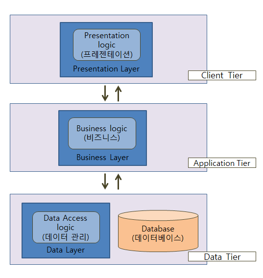
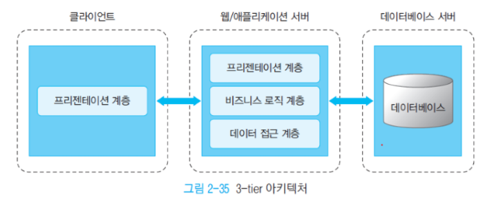
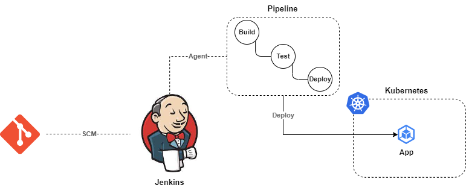
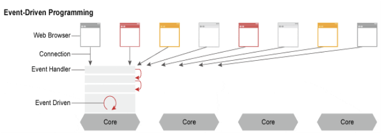
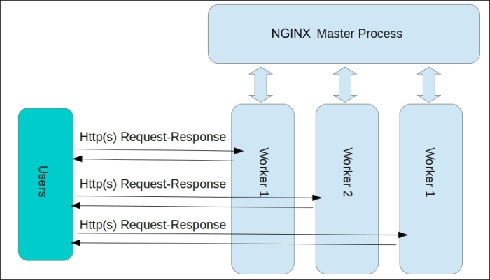
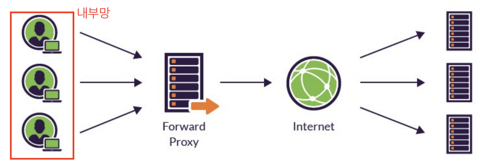
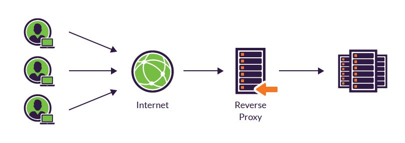
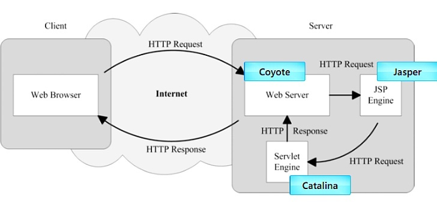
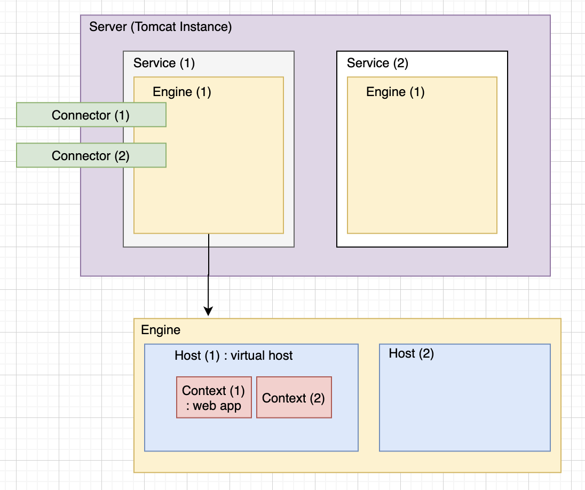

# 3 tier

> 어떠한 플랫폼을 3계층으로 나누어 별도의 논리적/물리적인 장치에 구축 및 운영하는 형태

## 프레젠테이션 계층 (Presentation Tier)

- 사용자가 직접 마주하게 되는 계층이다.
- 주로 사용자 인터페이스(인터넷 브라우저 등)를 지원한다.
- GUI 또는 프론트엔드(front-end) 라고도 부른다.
- 그러므로 이 계층에서는 사용자 인터페이스와 관계없는 데이터를 처리하는 로직은 포함하지 않는다.
- 주로 웹 서버를 예시로 들 수 있고, HTML, Javascript, CSS 등이 이 계층에 해당 된다.

## 어플리케이션 계층 (Application Tier)

- 이 계층에서는 (프레젠테이션 계층) 요청되는 정보를 어떠한 규칙을 바탕으로 처리하고 가공하는 것들을 담당한다.
- 비즈니스 로직 계층 또는 트랜잭션 계층 이라고도 한다.
- 첫 번째 계층에서 이 계층을 바라볼 때에는 서버처럼 동작하고(응답)
- 세 번째 계층의 프로그램에 대해서는 마치 클라이언트처럼 행동한다.(요청)

- 따라서 이 계층은 미들웨어(Middleware) 또는 백엔드(back-end)라고도 불린다.
- 이 계층에서는 프레젠테이션코드 (예를 들면 HTML, CSS)나 데이터 관리를 위한 코드는 포함하지 않는다.
- 주로 PHP, Java 등이 이 계층에 해당한다.

## 데이터 계층 (Data Tier)

- 데이터 계층은 데이터베이스와 데이터베이스에 접근하여 데이터를 읽거나 쓰는 것을 관리하는 것을 포함한다.
- 주로 DBMS (Database Management System)이 이 계층에 해당된다.
- 데이터 계층 또한 백엔드(back-end)라고도 부른다.
- 주로 MySQL, MongoDB 등이 이 계층에 해당된다.

## 장점
- 이렇게 3계층으로 구성을 하게 되면 계층 별 업무 분담이 가능해지므로 업무 효율성이 증가 할 수 있다.
- 또한 이중화 등을 통하여 서비스의 리스크 및 업무 부하를 줄일 수가 있다.
- 마찬가지로 특정 계층의 서버에 대해서만 합리적인 스케일업을 고려할 수도 있다.

## 단점
- 많은 계층이 있다는 것은 그만큼 관리 포인트가 증가한다는 의미이다.
- 문제가 생겼을 경우 빠르게 대처가 어려울 수 있다.
- 또한 계층에 따라 서버가 많아지기 때문에 서비스 규모 및 사용자 증가에 따른 적당한 계층 구조 및 설계가 고려되어야 한다.

> **📌 참고자료**  
> [3계층 구조(3 Tier- Architecture) 이해하기 [스마트인재개발원]](https://jaws-coding.tistory.com/)
> [3계층 구조(3 Tier Architecture)](https://velog.io/@yeavov/3%EA%B3%84%EC%B8%B5-%EA%B5%AC%EC%A1%B03-Tier-Architecture)

# CI/CD
## CI(Continuous Integration)
- Continuous Integration을 말한다 → 무엇을 통합한다는 것일까?
- 기본적으로 코드이다.
- 여러 명의 많은 개발자들이 코드 베이스를 계속해서 통합하는 것이다.
- 여러 개발자들의 코드를 각각 가능한 빠르게 배포를 하는 것을 의미한다.
- 즉 코드를 통합한다는 것이다.

## CD(Continuous Delivery)
- 내부 사용자(내부 QA, 마케터, 기획자)든, 사용자든 서비스를 지속적으로 배달한다.
- 즉 코드 베이스가 항상 배포 가능한 상태를 유지하는 것을 의미한다.
## CD(Continuous Deployment)
- 코드 베이스를 사용자가 사용 가능한 환경에 배포하는 것을 자동화하는 것이다.
- 버전 1 쓰다가 끊키지 않고 배포하는 것을 말한다.

> **즉, CI/CD란 각각의 개발자들이 개발을 하는 개발환경을 사용자가 사용 가능한 서비스로 전달하는 모든 과정을 지속 가능한 형태로 또 가능하다면 자동으로 해서 개발자와 사용자 사이의 격차를 없애는 것이다. 이러한 과정에는 코드를 빌드하고, 테스트하고 배포하는 활동이 있다.**

> **📌 참고자료**  
> [Jenkins란? (CI / CD와 Jenkins의 개념부터 ~ 예시 pipeline 까지)](https://velog.io/@bbkyoo/Jenkins)

# Jenkins
- Jenkins는 CI/CD를 위한 오픈 소스 도구로, 소프트웨어 개발 생명주기를 자동화 한다.
- 코드 변경 사항이 발생할 때마다 자동으로 빌드, 테스트, 배포 과정을 수행할 수 있다.
- 따라서 개발자는 코드 변경에 따른 빌드 및 테스트 과정을 수동으로 수행할 필요가 없어진다.
- 때문에 개발에 대한 코드 검증 및 배포할 수 있고, 이 과정에서 휴먼 에러를 방지할 수 있다.
## 구조
- Master/Slave라는 구조로 동작한다.
### Master
- Master는 **controller**라고도 불린다.
- Jenkins slave를 관리하고 작업 스케줄링과 slave 모니터링을 포함하여 다양한 작업을 관리한다.
### Slave
- Slave는 **agent**라고 불린다.
- 실제 파이프라인 작업을 수행한다.
- 다양한 환경에서 작동하며 작업을 분산시켜 부하를 감소시키는 역할을 한다.
- agent는 로컬 또는 클라우드 컴퓨터를 통해 Jenkins controller에 연결될 수 있다.
- 따라서 다양한 유연성을 제공한다.

### SCM (Source code Management)
- 코드가 보관되어 있는 Git 저장소에 코드 변경사항을 감지하여 자동으로 파이프라인을 수행할 수 있다.

### CI (Continuous Integration)
- 파이프라인이 실행되면 Agent를 통해 파이프라인 스크립트에 정의된 작업(job)이 실행된다.
- 이때 소스 코드 빌드, 코드 검증 테스트, 도커 이미지 빌드, 도커 이미지 검증 등 여러 작업이 순차적으로 진행된다.

### CD (Continuous Deployment)
- 파이프라인에서 정의한 배포 작업에 따라 배포된다.
### 파이프라인
- 파이프라인이란 CI/CD 파이프라인을 젠킨스에 구현하기 위한 일련의 플러그인들의 집합이자 구성이다.
- 즉 여러 플러그인들을 이 파이프라인에서 용도에 맞게 사용하고 정의함으로써 파이프라인을 통한 서비스가 배포된다.
- 젠킨스가 동작되기 위해서는 여러 플러그인들이 파이프라인을 통해 흘러가는 과정이라고 할 수 있다.

> **📌 참고자료**  
> [Jenkins란? 개념부터 설치 실행까지 (쿠버네티스 환경)](https://wlsdn3004.tistory.com/63#c1)
> [Jenkins란? (CI / CD와 Jenkins의 개념부터 ~ 예시 pipeline 까지)](https://velog.io/@bbkyoo/Jenkins)

# NGINX

- NGINX 는 웹 서비스, 리버스 프록시, 캐싱, 로드 밸런싱, 미디어 스트리밍 등을 위한 오픈 소스 소프트웨어이다.
- **멀티 프로세스 싱글 스레드** 방식으로 동작한다.
- **비동기 이벤트 방식으로 동작**해서 더 적은 메모리로 운영할 수 있다.

## 구조

- 하나의 Master Process와 N개의 고정된 Worker Process로 구성되어 있다.
- Master Process의 주 역할은 설정 파일을 읽거나 검증하며 Worker Process를 관리하는 역할을 수행한다.
- Worker Process에서 요청에 대한 실질적인 처리를 수행한다.
- Nginx는 비동기 이벤트 기반 모델을 통해서 Worker Process 간에 요청을 효율적으로 분산한다.

## Reverse Proxy
### Forward Proxy
> 내부망에 있는 **클라이언트들이 외부망에 접속할 때, Proxy Server를 거쳐** 연결되는 방식이다.

- 프록시 서버로 들어오는 패킷에 대해 **보안**정책을 적용할 수 있다.
- 프록시 서버 내부에 캐싱 기능이 있어, 이미 가져온 (캐싱에 있는) 데이터에 대해 외부 서버로부터 가져올 필요가 없어, 빠른 통신을 지원해 **성능상 이점**이 있다.
### Reverse Proxy
> 외부망에 있는 클라이언트들이 **내부망에서 제공하는 서비스에 접근할 때, 리버스 프록시 서버를 먼저 거쳐서 내부 서버로 들어오는 방식**

- 외부망에 있는 **클라이언트는 실제로 내부망에 있는 서버의 존재를 모른다.** 
  모든 적속은 리버스 프록시 서버에게 들어오며, 리버스 프록시는 요청에 매핑되는 내부 서버의 정로를 알고 있고, 그에 따라 요청을 넘겨준다.
  따라서 **내부 서버의 존재를 외부로부터 숨길 수 있어 보안상 이점**이 있다.

> **📌 참고자료**  
> [Nginx 동작 방식부터 프록시, 로드밸런서까지](https://willseungh0.tistory.com/137)
# Tomcat
> 아파치 소프트웨어 재단의 웹 어플리케이션 서버 (Web Application Server, WAS)

- 자바 서블릿을 실행시키고 JSP코드가 포함되어 있는 동적 웹 페이지를 구동시켜주는 프로그램이다.
- 내장되어 있는 웹 서버를 이용해 독립적으로 사용될 수도 있으나 아파치(httpd), Nginx 등의 웹 서버와 함께 사용할 수도 있다.

## 구조

- Coyote (HTTP Component) : Tomcat에 TCP를 통한 프로토콜 지원
- Catalina (Servlet Container) : 자바 서블릿을 호스팅하는 환경
- Jasper (JSP Engine) : 실제 JSP 페이지의 요청을 처리하는 Servlet

## 동작
- HTTP 요청을 Coyote에서 받아서 Catalina로 전달
- Catalina에서 전달받은 HTTP 요청을 처리할 웹 어플리케이션을 찾고 WEB-INF/web.xml 파일 내용을 참조하여 요청을 전달
- 요청된 Servlet을 통해 생성된 JSP 파일들이 호출될 때 Jasper가 Validation Check/Compile등을 수행
### 처리순서
- HTTP request → Catalina → Context →Servlet → Respnose

- **Tomcat**은 JVM 위에서 동작
- **하나의 JVM**에서 **하나의 Tomcat Instance가 하나의 Process**로 동작
- **하나의 Server**에는 **여러 개의 Service**가 존재 가능, 각각의 **Service는 1개의 Engine**과 **여러 개의 Connector**로 구성
- **Engine**은 Catalina Servlet Engine이라고도 불리며, 정의된 Connector로 들어온 요청을 하위에 있는 해당 Host에게 전달해주는 역할을 수행
- **하나의 Engine**에는 **여러 개의 Host**가 존재 가능, Host는 가상호스트 이름을 나타내며, 호스트 이름이 곧 url에 매핑
- **Host**에는 **여러 개의 Context**가 존재 가능, Context는 하나의 Web Application을 나타내며 주로 \*.war 파일의 형태로 배포
- Tomcat Server가 요청을 받으면, Catalina (Tomcat Engine)가 요청에 맞는 Context (Context path)를 찾고, Context는 자신이 설정된 어플리케이션의 deployment descriptor file (web.xml)을 기반으로 전달받은 요청을 서블릿에게 전달하여 처리

> **📌 참고자료**  
> [Tomcat이란?](https://velog.io/@hsk2454/Tomcat%EC%9D%B4%EB%9E%80)
