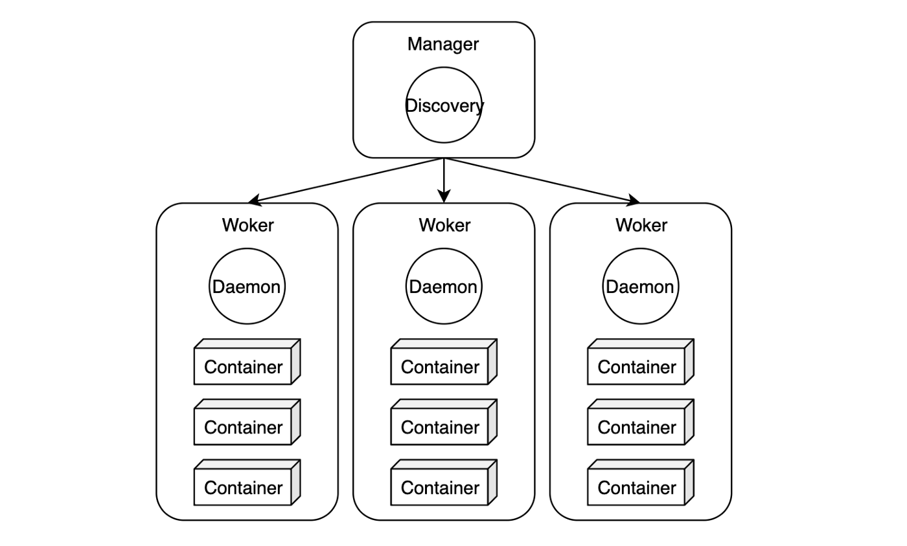

# Docker Swarm(도커 스웜)

Swarm은 무리, 군중이라는 의미를 가지고 있다. Docker Swarm은 도커 컨테이너를 위한 **클러스터링, 스케줄링 툴**이다.  
Swarm을 이용하면 **여러 개의 서버와 컨테이너 관리**를 쉽게 할 수 있다.  
즉 Docker Swarm은 **여러 대의 Docker 호스트들을 마치 하나인 것처럼** 만들어주는 **Orchestration** 도구이다.

## 사용 이유
운영 중인 서비스의 더치가 커져 서버의 자원이 부족할 경우, 서버의 사양을 높이면 되지만 비용, 서버 교체 등은 부담이 될 수 있다.  
**하지만 도커 스웜은 여러 서버를 하나의 클러스터(군집)로 묶어 자원을 병렬로 확장하게끔 도와주는 역할**을 한다.  
즉, 서로 다른 호스트의 여러 컨테이너를 하나로 묶어 마치 하나의 호스트처럼 사용할 수 있도록 도와준다.  

## 용어 정리

### Node
- 러스터에 속한 도커 서버 단위이다. 보통 **한 서버에 하나의 도커 데몬**을 실행하기 때문에 **노드는 곧 서버**라고 이해할 수 있다. (**1 Node = 1 Server**)  

> [!NOTE] 도커 데몬이란?
> 도커 프로세스가 실행되어 서버로서 입력을 받을 준비가 된 상태를 **도커 데몬**이라고 한다.
### Manager
- 매니저는 **클러스터 상태**를 관리한다. 명령어는 매니저 노드에서만 실행할 수 있다.
- 아키텍처상에서 매니저는 **High Availability(고가용성)**를 위하여 여러대 실행되어야 한다. 일반적으로 노드마다 매니저가 배포된다.
- 도커에서는 **최대 수를 7개**로 잡고 있으며 그 이상의 노드는 성능 저하를 일으킬 수 있다고 경고한다.
- 매니저 노드는 아래의 업무를 통해 도커 클러스터를 관리한다.
> 1. **클러스터의 상태를유지**: [뗏목 합의 알고리즘](https://seongjin.me/raft-consensus-algorithm/) 사용
> 2. **스케줄링 서비스**: 작업자 노드(worker)에게 컨테이너를 배포한다. 특정 노드에게만 배포하거나, 모든 노드에 하나씩 배포할 수 있다.
> 3. **스웜 모드 제공**: docker swarm init

> [!NOTE] 고가용성이란?
> 고가용성은 서버, 네트워크, 프로그램 등의 정보 시스템이 상당히 오랜 기간 동안 지속적으로 정상 운영이 가능한 성질을 말한다. 고가용성이란 "가용성이 높다"는 뜻으로서, "절대 고장 나지 않음"을 의미한다.
### Worker
- 도커에서 일반적으로 **컨테이너를 실행하는 노드**를 작업자 노드라고 한다.  
  매니저의 **명령을 받아 컨테이너를 생성하고 상태를 체크**한다.  
  일반 사원에게 관리직을 맡기지 않는 것처럼 작업자 노드에게 매니저 노드가 하는 일(스케줄링, 합의)을 맡기지 않는다. 서비스 규모에 맞게 많이 실행하고, **요청이 많아 지면 Worker를 스케일아웃** 한다.
- **작업자 노드들**의 클러스터는 **반드시 하나 이상의 관리자 노드**를 가져야 한다. 매니저 노드 역시 작업자에 속하긴 한다. **단일 매니저를 둔 노드 클러스터**에서도 **docker service create라는 명령어**로 도커 스웜을 실행할 수 있다.
- 도커 스웜을 실행할 때, 스케줄러가 매니저 노드에게 작업자 노드가 하는 **Task(컨테이너를 배포하고 관리)를 실행시키지 않기 위해서**는 아래의 명령어로 매니저 노드의 가용성을 **drain(배수, 빼내다 등의 의미)으로 설정**한다. 스케줄러는 **drain 상태의 노드에는 task를 맡기지 않고 active 상태의 노드에게만 task를 할당**한다.

### Service Discovery
- 서비스 디스커버리는 **컨테이너의 실행 위치와 상태를 제공**해준다. 이를 위하여 **자체 DNS 서버**를 가지고 있다. 컨테이너를 생성하면 **서비스명과 동일한 도메인을 등록**하고, 반대로 **멈추면 도메인을 제거**한다.
### Service
- **기본적인 배포 단위**다. **하나의 서비스는 하나의 이미지를 기반**으로 생성하고 동일한 컨테이너를 한개 이상 실행할 수 있다. 최종적으로 배포되는 **서비스는 여러 개의 task로 구성**된다.

### Task
- **컨테이너 배포 단위**다. 각각의 테스크가 컨테이너를 관리한다. 보통 개별 도커 컨테이너를 의미하지만, 컨테이너를 실행할 때 명령어도 포함한다.

## 뗏목 합의 알고리즘
### 언제 사용될까?
도커 스웜에서 매니저 노드는 클러스터의 모든 정보를 포함하고 있다. 때문에 매니저 노드가 죽게되면 클러스터도 다운되게 된다.  
이러한 문제를 해결하기 위해 도커 스웜은 뗏목 합의 알고리즘을 이용한 멀티 매니저 노드 기능을 지원한다.  
멀티 매니저 노드 기능을 사용하면 여러 개의 매니저 노드를 생성하여 한 매니저 노드(리더 매니저 노드)가 갑자기 죽게 되더라도 다른 매니저 노드가 다시 서비스를 안정적인 상태로 복원할 수 있다.   
하지만 이를 위해서는 모든 매니저 노드가 동일한 상태를 유지하고 있어야 하는데, 이때 사용되는 알고리즘이 뗏목 합의 알고리즘이다.
## 도커 스웜 네트워크

> [!TODO]
> 양이 많은거 같아서 6주차에 실습하면서 정리할 예정
>> [!QUOTE] 참고 자료
>> - https://watch-n-learn.tistory.com/49
>> - https://yoo11052.tistory.com/184

# 참고 자료
> [!QUOTE] 도커 스웜
> - https://velog.io/@1996yyk/Docker-Swarm-%EC%97%90-%EB%8C%80%ED%95%B4%EC%84%9C
> - https://blog.dglee.co.kr/12

> [!QUOTE] 뗏목 합의 알고리즘
> - https://yoo11052.tistory.com/182
> - https://seongjin.me/raft-consensus-algorithm/
