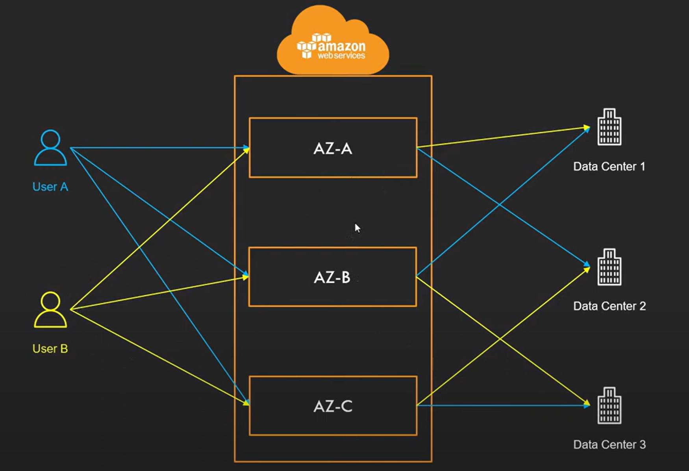
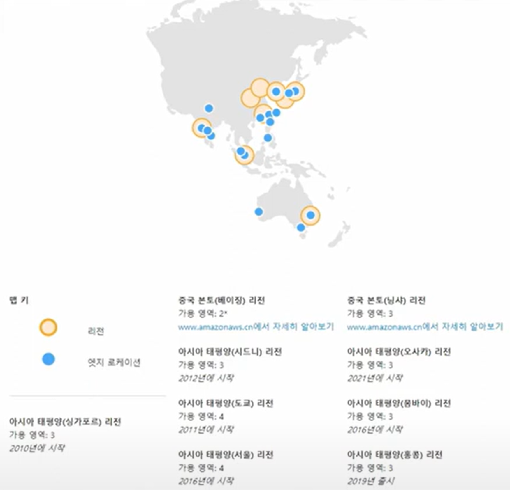
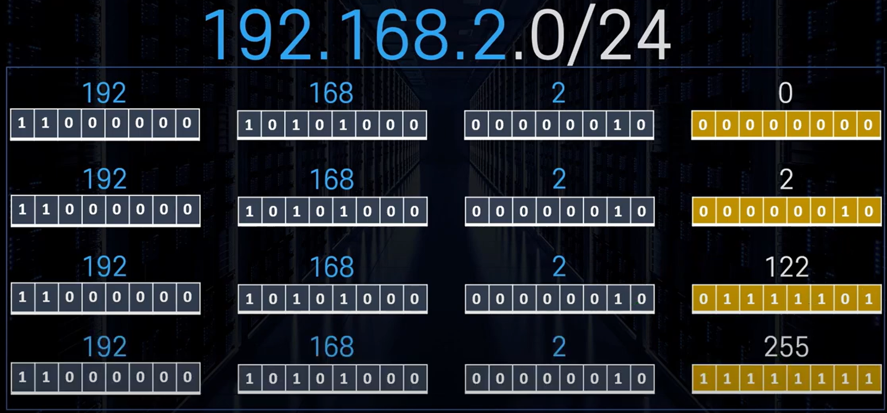
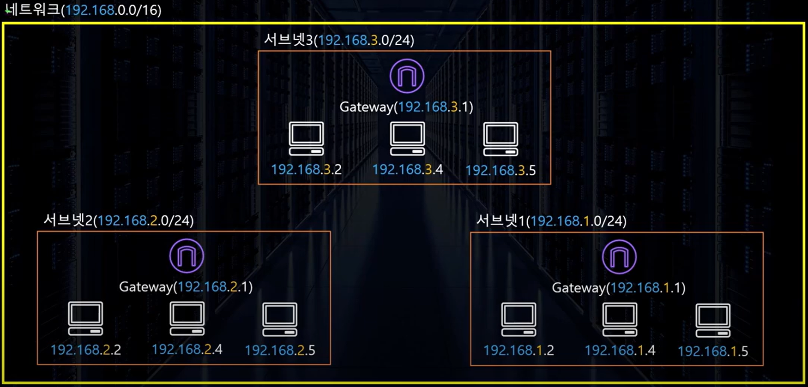
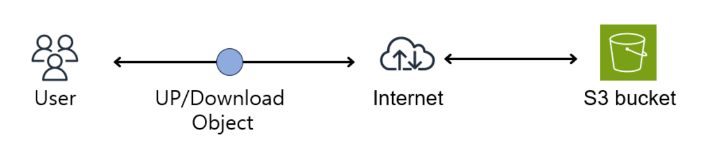

## 리전 & 가용영역

- 리전

리전은 전 세계에 분포되어 있는 서버의 물리적 위치이다.

동남아, 유럽, 북아메리카 등 큰 구분으로 묶여 있고, 각 리전마다 고유의 코드가 있다.

리전을 선택할 때 내가 서비스를 만드는 지역과 가까운 리전을 선택하면 서비스를 빠르게 제공할 수 있다.

- 가용영역

1개 이상의 데이터 센터로 구성된 곳을 가용영역이라고 하며, 각각의 리전은 2개 이상의 가용영역으로 구성되어야 한다.

리전 안에 여러개의 가용영역이 있는 구조이기 때문에 모든 가용영역은 100km 이내의 거리에 위치해야 한다. 그러나 특정 가용영역에 재해가 일어나는 일에 대비하기 위해 서로 일정 거리 떨어져 있어야 한다.

가용영역 코드가 가리키는 데이터 센터의 위치는 사용자마다 다르다. 그 이유는 보안과 트래픽 몰림 방지이다.

User A가 AZ-A를 선택해도 어떤 데이터 센터에 가는지 알 수 없어 보안적으로 좋다.

또한, 많은 사용자들이 AZ-Z를 선택해도 데이터 센터는 랜덤적으로 선택되기 때문에 한 곳에만 트래픽이 몰리는 일을 방지할 수 있다.

## EC2

- Amazon Elastic Compute Cloud

EC2는 안전하고 크기 조정이 가능한 컴퓨팅 파워를 클라우드에서 제공하는 웹 서비스이다.

*컴퓨팅 파워: 컴퓨터 기술 자원을 개발 및 사용하는 모든 활동

EC2를 통해 가상 서버를 구축할 수 있고, 보안 및 네트워크 구성과 스토리지 관리가 가능하다.

또한, 요구 사항이나 갑작스러운 트래픽 증가 등 변동 사항에 따라 규모를 확장하거나 축소할 수 있다.

- EC2의 특성
    - 초 단위 온디맨드 가격 모델이다.
        - 가격이 초 단위로 결정되기 때문에 사용한만큼만 요금을 내면 된다.
    - 구축 속도가 빠르다.
        - 몇 분이면 전 세계에 인스턴스 수백여개를 구축할 수 있다.
    - 다양한 구성방법을 지원한다.
        - 웹서버, 이미지처리 등 다양한 용도에 최적화된 서버를 구성할 수 있다.

## CloudFront & Edge Location

- CloudFront

CloudFront는 AWS에서 제공하는 CDN (Contents Delivery Network) 서비스이다.

CDN이란 사용자와 가까운 곳에 위치한 Cache Server에 Content를 저장(캐싱)하고 Content 요청시에 Cache Server가 응답을 주는 기술이다.

CloudFront는 Edge Location을 전 세계 여러곳에 두고 사용자와 가장 가까운 곳을 찾아 데이터를 빠르게 제공한다.

- Edge Location

Edge Location은 AWS의 CloudFront 등의 서비스들을 빠른 속도록 제공(캐싱)하기 위한 거점이다.

## CIDR & Subnet

- CIDR (Classless Inter Domain Roution)

IP 주소의 영역을 **여러 네트워크 영역으로 나누기 위해** IP를 묶는 방식이다.

- CIDR Block

나눠진 영역의 IP 주소들 집합이다.

- CIDR Notation

CIDR Block을 표시하는 방법으로, A.B.C.D/E 형식으로 되어있다.

A, B, C, D는 네트워크 주소와 호스트 주소를 표시하고, 각각 8비트로 되어 있다. E는 0~32의 숫자가 들어가는데, 해당 숫자는 앞에부터 비트수를 나타내며 네트워크 주소가 몇 bit인지 표시한다. 예를 들어, E가 16이면 8 + 8이기 때문에 A, B까지가 네트워크 주소이고 C, D는 호스트 주소가 된다.

숫자를 넣은 예시는 다음과 같다.

E가 24이기 때문에 8 + 8 + 8이므로 192.168.2는 네트워크 주소이다. 네트워크 주소는 변동되지 않고, 남은 0부터 255까지 총 256개의 호스트 주소를 표현할 수 있다.

따라서 CIDR Block은 호스트 주소의 비트만큼 IP 주소를 보유할 수 있다.

- Subnet

CIDR Notation 방법을 이용해 네트워크를 쪼갠 단위를 Subnet이라고 한다.

큰 네트워크에 부여된 IP 범위를 작은 단위로 나눈 후 서브넷에 할당한다.

## VPC

- VPC (Virtual Private Cloud)

VPC는 AWS 계정 전용 가상 네트워크이다. 외부와 격리되어 있는 가상의 네트워크라고 볼 수 있다. 부여된 IP를 분할하여 사용할 수 있다.

- VPC 사용 사례
    - EC2 등 AWS의 서비스 실행
    - 다양한 서브넷 구성
    - 인터넷에 노출되지 않는 EC2 구성하는 등의 보안 설정

## Security Group & NACL

- Security Group
    - 방화벽 역할을 하는 서비스로, 지나갈 수 있는 Port를 설정할 수 있다.
    - 인스턴스 단위이고, 한 개의 인스턴스에 여러 개의 Security Group을 설정할 수 있다.
    - Stateful이기 때문에 Inbound로 들어온 트래픽은 Outbound에 설정 없이 나갈 수 있다.
- NACL (Network Access Control List)
    - 방화벽 역할을 하는 서비스로, 지나갈 수 있거나 지나갈 수 없는 Port와 IP를 설정할 수 있다.
    - 서브넷 단위이고, 한 개의 서브넷 안에 있는 모든 요소들은 한 개의 NACL에 영향을 받는다.
    - Stateless이기 때문에 Inbound로 들어온 트래픽도 Outbound에 설정해줘야 한다.

## S3

- S3 (Simple Storage Service)

S3는 파일, 데이터 등을 저장하기 위해 사용할 수 있는 서비스이다. 저장하는 비용이 저렴하고, 무한에 가깝게 저장할 수 있다.

- Bucket & Object

Bucket 안에 파일, 사진, 동영상 등 다양한 데이터를 담을 수 있고, 데이터에는 이름, 크기, 만들어진 날짜 등이 있다.

Bucket에 있는 데이터 하나하나가 S3 안에 있는 Object가 된다.

즉, S3는 데이터를 인터넷을 통해 객체 형태로 저장하는 서비스이다.

---

**출처**

- 리전, 가용영역, CloudFront, 엣지 로케이션
    - https://www.youtube.com/watch?v=tvwDDM-Y-qE&list=PLfth0bK2MgIan-SzGpHIbfnCnjj583K2m&index=4
    - https://real-dongsoo7.tistory.com/86
- EC2
    - https://www.youtube.com/watch?v=rdlHszMujnw&list=PLfth0bK2MgIan-SzGpHIbfnCnjj583K2m&index=8
    - [https://ko.wikipedia.org/wiki/컴퓨터_성능](https://ko.wikipedia.org/wiki/%EC%BB%B4%ED%93%A8%ED%84%B0_%EC%84%B1%EB%8A%A5)
- CIDR, Subnet, VPC
    - https://www.youtube.com/watch?v=3VXLD0-Iq8A&list=PLfth0bK2MgIan-SzGpHIbfnCnjj583K2m&index=16
    - https://www.youtube.com/watch?v=WY2xoIClOFA&list=PLfth0bK2MgIan-SzGpHIbfnCnjj583K2m&index=17
- Security Group, NACL
    - https://www.youtube.com/watch?v=IJgAIbxxJCE&list=PLfth0bK2MgIan-SzGpHIbfnCnjj583K2m&index=18
- S3
    - https://bigco-growth-diary.tistory.com/43
    - https://somaz.tistory.com/179
