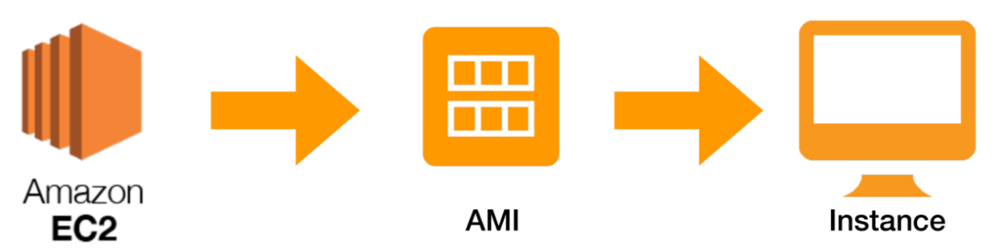
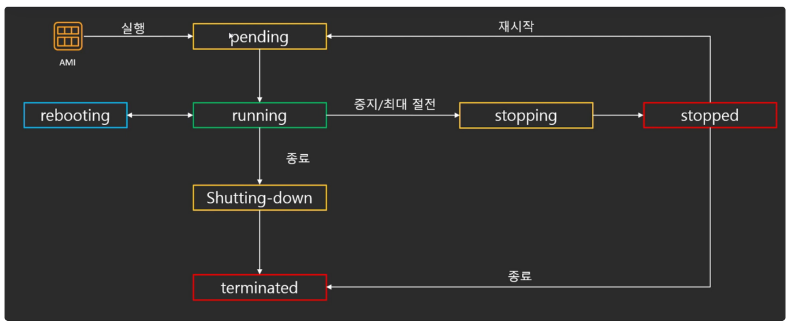
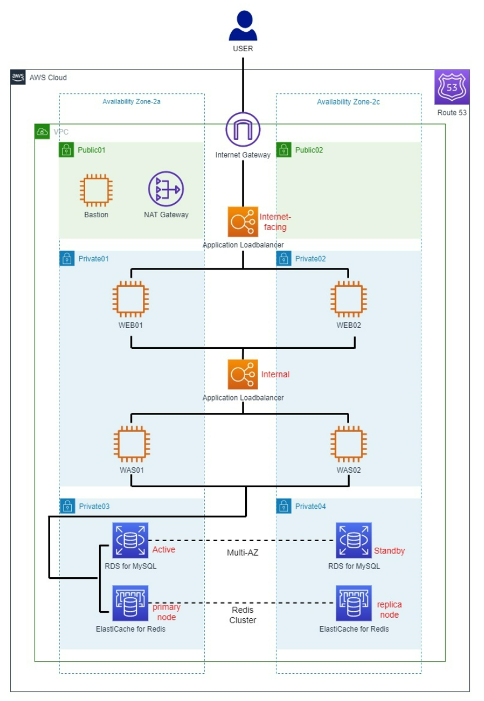
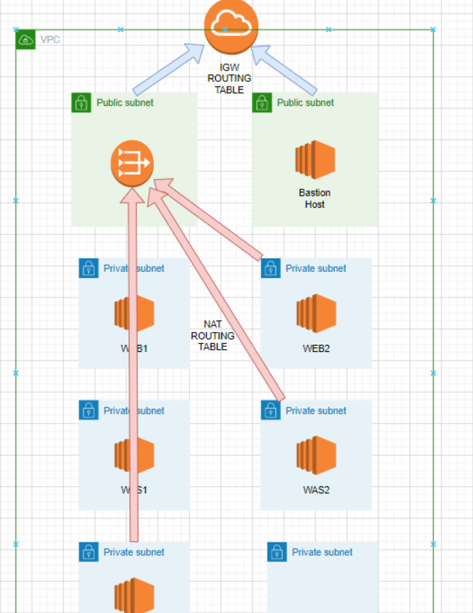
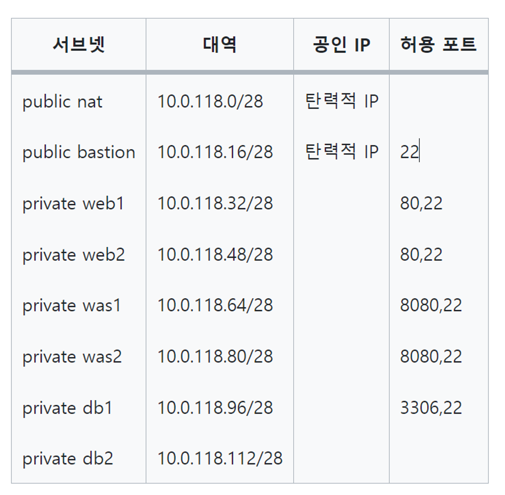
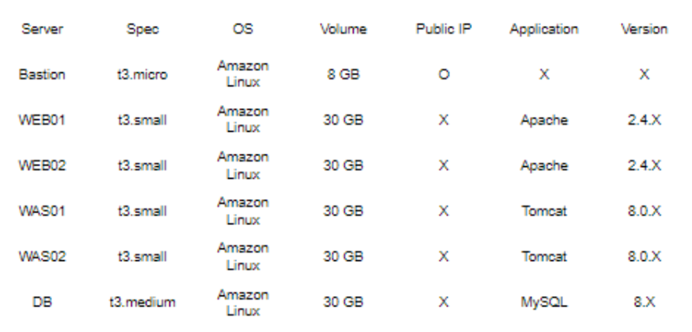
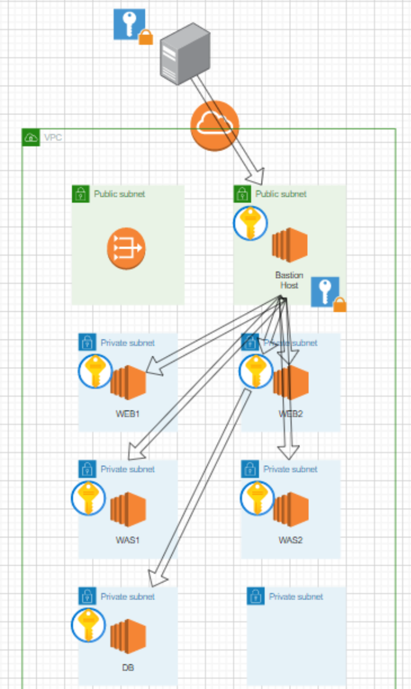
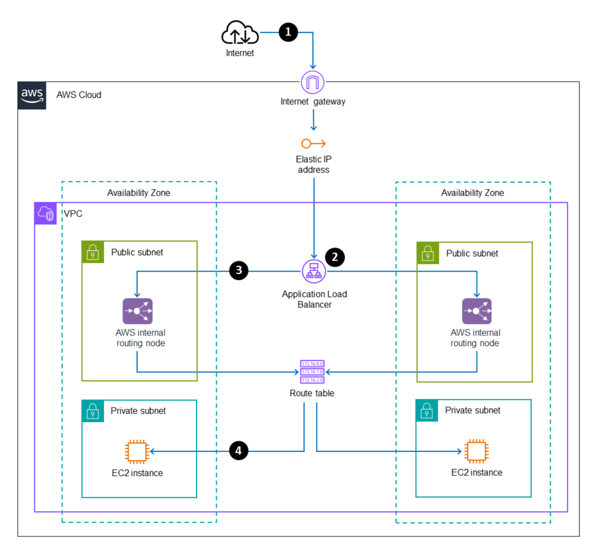
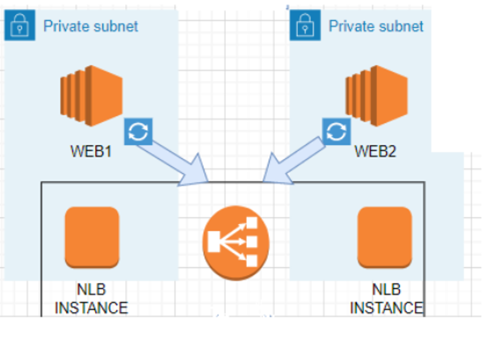
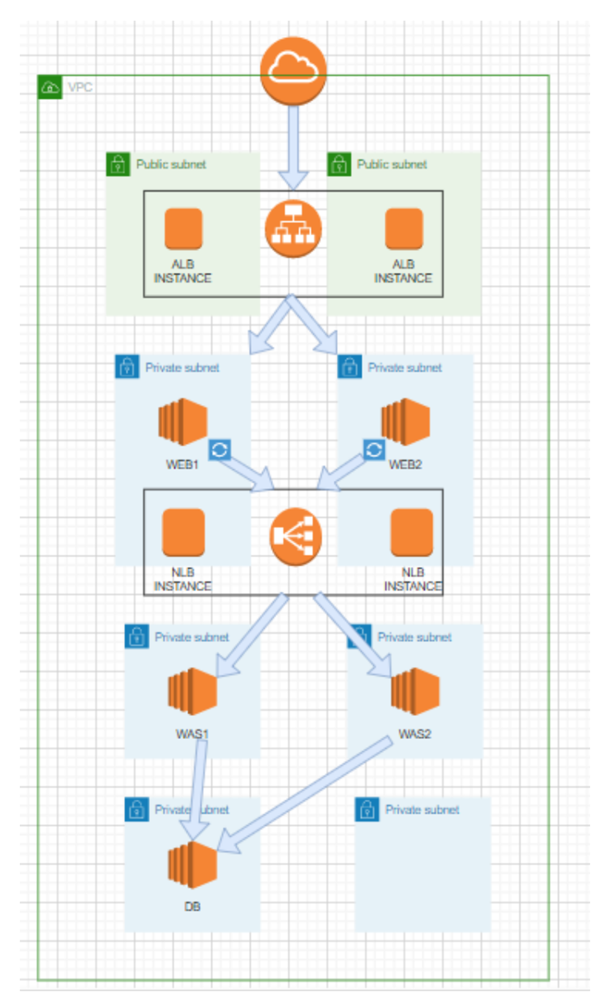

# 1주차 AWS 구조 추가 공부한 부분

> **만약 A 가용영역에는 서버가 5대, B가용영역에는 서버가 1대 이렇게 구성이 되어 있어도 랜덤선택 방법으로 트래픽이 몰리는 것을 방지할 수 있을까?**

AWS는 로드 밸런서를 이용해 트래픽을 가용영역에 분산한다. 로드 밸런서는 헬스 체크를 통해  서버의 상태를 모니터링하여 정상적인 서버에만 트래픽을 보내기 때문에 트래픽이 몰리는 것을 방지할 수 있다.

## EC2

- Amazon Elastic Compute Cloud

EC2는 안전하고 크기 조정이 가능한 컴퓨팅 파워를 클라우드에서 제공하는 웹 서비스이다.

*컴퓨팅 파워: 컴퓨터 기술 자원을 개발 및 사용하는 모든 활동

EC2를 통해 가상 서버를 구축할 수 있고, 보안 및 네트워크 구성과 스토리지 관리가 가능하다.

또한, 요구 사항이나 갑작스러운 트래픽 증가 등 변동 사항에 따라 규모를 확장하거나 축소할 수 있다.

- EC2의 특성
    - 초 단위 온디맨드 가격 모델이다.
        - 가격이 초 단위로 결정되기 때문에 사용한만큼만 요금을 내면 된다.
    - 구축 속도가 빠르다.
        - 몇 분이면 전 세계에 인스턴스 수백여개를 구축할 수 있다.
    - 다양한 구성방법을 지원한다.
        - 웹서버, 이미지처리 등 다양한 용도에 최적화된 서버를 구성할 수 있다.
- 인스턴스

AWS EC2 인스턴스를 생성한다. == AMI를 토대로 운영체제, CPU, RAM 등이 구성된 컴퓨터를 빌린다.

인스턴스는 범용, 컴퓨팅 최적화, 메모리 최적화, 저장 최적화와 같이 목적에 따라 여러가지 타입이 존재한다.  타입은 t타입, m타입, g타입 등 이름을 부여해 구분한다.

- Instance Life Cycle

  인스턴스는 AMI로부터 실행되고 종료될 때까지 다양한 상태로 바뀐다.

    

    - pending state
        - 준비 상태
        - EC2를 가동하기 위해 ENI, EBS 등이 준비되는 과정이다.
    - running state
        - 사용할 수 있는 상태
        - running state에서 할 수 있는 3가지
            - 중지
                - EBS를 사용하는 인스턴스는 중지시킬 수 있고, 인스턴스를 중지시키면 요금이 청구되지 않는다. (다른 구성 요소에 대한 요금은 청구된다.)
                - 중지 후 다시 시작하면 퍼블릭 IP가 바뀌기 때문에 바뀌지 않게 하려면 탄력적 IP를 사용해야 한다.
            - 재부팅
                - 인스턴스를 다시 시작하는 것으로, 중지와 달리 퍼블릭 IP가 바뀌지 않는다.
            - 최대 절전 모드
                - 메모리 내용을 보존하기 때문에 재시작해도 중단지점에서 시작할 수 있는 중지모드이다.
                - 요금이 청구된다.
        - shutting-down state
            - 인스턴스 종료중인 상태
        - terminated state
            - 종료된 상태
            - 인스턴스가 삭제된다.

## AMI

- Amazon Machine Images

EC2 인스턴스를 실행하는  데 필요한 정보가 담긴 템플릿이다. AMI의 안에 운영체제, 저장 공간 용량 등을 구성할 수 있다.

(대표적인 운영체제: Amazon Linux2, CentOS, Red Hat, Enter prise Linux, Windows Server, Ubuntu)

AWS에 있는 AMI 셋팅들을 사용해 쉽게 인스턴스의 운영체제를 구성할 수 있고, 직접 AMI를 구성할 수 있다.

- AMI에 포함된 것
    - 1개 이상의 EBS 스냅샷 or 인스턴스의 템플릿 (ex. 운영체제)
    - 인스턴스를 시작할 수 있는 권한
    - 인스턴스에 연결할 볼륨을 지정하는 블록 디바이스 매핑

## EBS

- Elastic Block Store

EBS는 인스턴스에 사용할 영구 블록 스토리지 볼륨을 제공하는 것으로, 하드디스크와 같은 역할을 한다.

- Snapshot
    - Snapshot은 특정 시간의 EBS 상태 저장본이다.
    - S3에 변화한 부분만 저장하고, 특정 시간의 EBS를 복구할 수 있다.
- Instance Storage VS EBS Based
    - Instance Storage
        - EC2 안에  물리적으로 연결되어 있다.
        - EC2를 종료시키면 함께 삭제된다.
        - 빠른 연산을 하거나, 저장할 필요가 없을 때 사용한다.
        - stop이 불가능한다.
    - EBS Based
        - EC2와 네트워크로 연결되어 있다.
        - EC2를 종료시켜도 삭제되지 않기 때문에 재사용이 가능하다.
        - Snapshopt 기능이 있다.
        - stop이 가능하다.

# 3 Teir **Architecture**

플랫폼이나 애플리케이션을 3 계층으로 나누어 별도의 논리적 / 물리적인 장치에 구축 및 운영하는 형태이다.

- 1계층
    - clinet-tier : presentation layer
    - 사용자가 애플리케이션과 상호작용하는 애플리케이션의 사용자 인터페이스이다.
    - 일반적으로 HTML, JS, CSS 등이 이 계층에 포함된다.
- 2계층
    - Application Tier
    - 요청되는 정보를 규칙에 따라 처리하고 가공한다.
- 3계층
    - Data Tier
    - 데이터베이스에 접근하여 데이터를 CRUD 한다.

- 3 teir를 사용하면?
    - 계층간 분리를 통해 역할을 분담시켜 일을 효율적으로 할 수 있다.
    - 각 계층간의 독립성이 높아져 문제가 생겼을 때, 문제가 되는 부분만 해결하면 된다.
    - 서버를 계층별 독립적으로 존재하기에 확장하기 편하다.
    - 보안적인 측면에서 1, 2 계층보다 좋다.
- 3 teir 단점
    - 1, 2 계층보다 관리가 더 필요하다.
    - 설계 및 구축이 어렵다.
    - 비용이 많이 발생한다.

# 3 Teir **Architecture 구축하기**

## VPC, 서브넷, 인스턴스 구성

1. VPC를 생성하고 안에 서브넷을 구성한다.

 

2. 각각의 서브넷에 인스턴스를 생성한다.

3. Internet Gateway를 생성하고, 라우팅 테이블을 생성한다.
    1. Internet Gateway
        1. public 서브넷이 인터넷과 연결되기 위해 필요하다.
        2. Bastion Host와 Nat Gateway가 외부망과 통신하기 위한 게이트웨이이다.
    2. Internet 라우팅 테이블: 서브넷에서 밖으로 나가는 아웃바운드에 대한 라우팅 경로를 설정하는 것이다.
    3. 라우팅 테이블에 모든 ip주소가 인터넷 게이트웨이로 라우팅하게 설정한다.

4. Nat Gateway를 생성하고, 라우팅 테이블을 생성한다.
    1. Nat Gateway: Private Subnet의 인스턴스가 외부와 통신하기 위한 Gateway이다.
    2. NAT 라우팅 테이블: Private Subnet에서 외부의 주소로 향할 때, Nat Gateway를 거쳐가기 위한 테이블이다.

5. Bastion Host를 생성한다.
    1. Bastion Host를 통해 SSH 접근을 한다.

        

6. ALB(Application Load Balancer)를 생성한다.
    1. ALB 인스턴스는 2개의 가용 영역에 위치한 Public Subnet에 위치한다.

        

    1. 외부에서 ALB의 EIP 주소를 향해 트래픽을 보내면 인터넷 게이트웨이를 통해 ALB로 들어온다.
    2. 해당 트래픽을 ALB의 Internal Routing Node에게 보낸다.
    3. 라우팅 규칙을 통해 트래픽을 보낼 대상 그룹 및 인스턴스를 찾는다.
    4. ALB에서 트래픽을 동일한 가용영역에 있는 인스턴스에게 보낸다

7. APACHE , Tomcat 설치한다.
8. NLB를 생성한다.
    1. NLB 인스턴스는 2 개의 가용 영역에 위치한 Web Private Subnet에 위치한다.

        
   2. NLB 인스턴스의 8080번 포트를 Listen 상태로 설정하여, 해당 포트로 들어오는 트래픽은 WAS 인스턴스로 전달하게 설정한다.

9. WAS와 DB를 연동한다.

## 전체 흐름

1. Client가 ALB DNS 주소에 접속
2. IGW를 통해 ALB에 트래픽 전달
3. ALB에서는 대상그룹을 지정한 APACHE 서버에 트래픽 전달
4. APACHE 서버에서 Reverse Proxy를 통해 NLB에 트래픽 전달
5. NLB에서는 TOMCAT에 트래픽 전달
6. TOMCAT에서 MySql로부터 데이터를 불러와서 페이지 구성요청이 들어온 순서의 역순으로 HTTP 응답 메세지를 Client에게 전송

---

**출처**

- EC2
    - https://www.youtube.com/watch?v=rdlHszMujnw&list=PLfth0bK2MgIan-SzGpHIbfnCnjj583K2m&index=8
    - [https://ko.wikipedia.org/wiki/컴퓨터_성능](https://ko.wikipedia.org/wiki/%EC%BB%B4%ED%93%A8%ED%84%B0_%EC%84%B1%EB%8A%A5)
    - [https://velog.io/@server30sopt/AWS-EC2-개념-정리](https://velog.io/@server30sopt/AWS-EC2-%EA%B0%9C%EB%85%90-%EC%A0%95%EB%A6%AC)
- AMI
    - [https://velog.io/@server30sopt/AWS-EC2-개념-정리](https://velog.io/@server30sopt/AWS-EC2-%EA%B0%9C%EB%85%90-%EC%A0%95%EB%A6%AC)
    - [https://velog.io/@ghldjfldj/AWS-AMI란-무엇인가](https://velog.io/@ghldjfldj/AWS-AMI%EB%9E%80-%EB%AC%B4%EC%97%87%EC%9D%B8%EA%B0%80)
- EBS
    - https://velog.io/@ghldjfldj/AWS-EBSAMISG
- 3 teir
    - https://hyeyeon13.tistory.com/26
    - [https://velog.io/@lijahong/0부터-시작하는-AWS-공부-3-Tier-구축-1편-구축-계획-VPC-Bastion-Host#3-tier](https://velog.io/@lijahong/0%EB%B6%80%ED%84%B0-%EC%8B%9C%EC%9E%91%ED%95%98%EB%8A%94-AWS-%EA%B3%B5%EB%B6%80-3-Tier-%EA%B5%AC%EC%B6%95-1%ED%8E%B8-%EA%B5%AC%EC%B6%95-%EA%B3%84%ED%9A%8D-VPC-Bastion-Host#3-tier)
    - [https://velog.io/@lijahong/0부터-시작하는-AWS-공부-3-Tier-구축-프로젝트-2-WEB-WAS-LB#alb-인바운드-트래픽-흐름](https://velog.io/@lijahong/0%EB%B6%80%ED%84%B0-%EC%8B%9C%EC%9E%91%ED%95%98%EB%8A%94-AWS-%EA%B3%B5%EB%B6%80-3-Tier-%EA%B5%AC%EC%B6%95-%ED%94%84%EB%A1%9C%EC%A0%9D%ED%8A%B8-2-WEB-WAS-LB#alb-%EC%9D%B8%EB%B0%94%EC%9A%B4%EB%93%9C-%ED%8A%B8%EB%9E%98%ED%94%BD-%ED%9D%90%EB%A6%84)
    - [https://velog.io/@lijahong/0부터-시작하는-AWS-공부-3-Tier-구축-3편-DataBase](https://velog.io/@lijahong/0%EB%B6%80%ED%84%B0-%EC%8B%9C%EC%9E%91%ED%95%98%EB%8A%94-AWS-%EA%B3%B5%EB%B6%80-3-Tier-%EA%B5%AC%EC%B6%95-3%ED%8E%B8-DataBase)
    - [https://velog.io/@lijahong/0부터-시작하는-AWS-공부-3-Tier-구축-4-결과-살펴보기#alb](https://velog.io/@lijahong/0%EB%B6%80%ED%84%B0-%EC%8B%9C%EC%9E%91%ED%95%98%EB%8A%94-AWS-%EA%B3%B5%EB%B6%80-3-Tier-%EA%B5%AC%EC%B6%95-4-%EA%B2%B0%EA%B3%BC-%EC%82%B4%ED%8E%B4%EB%B3%B4%EA%B8%B0#alb)
