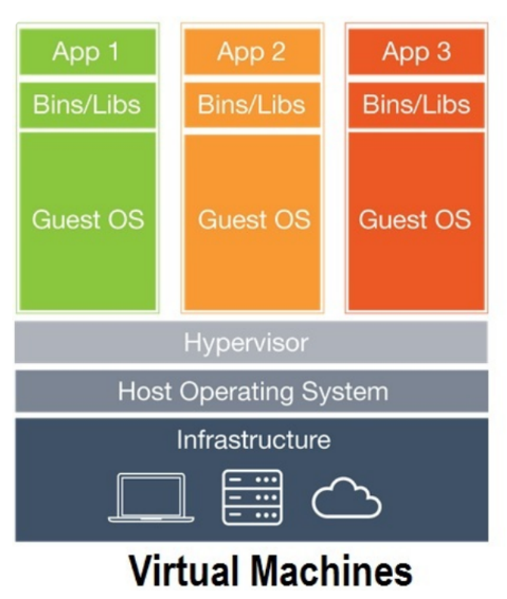
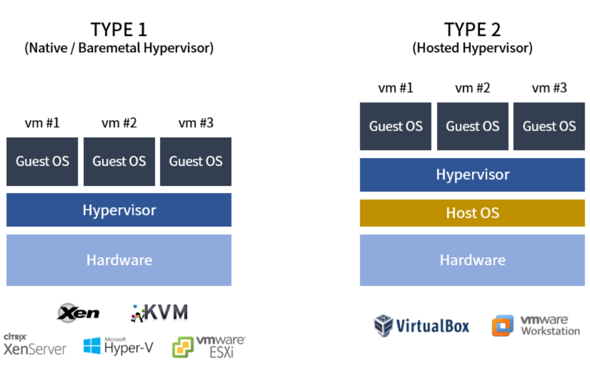
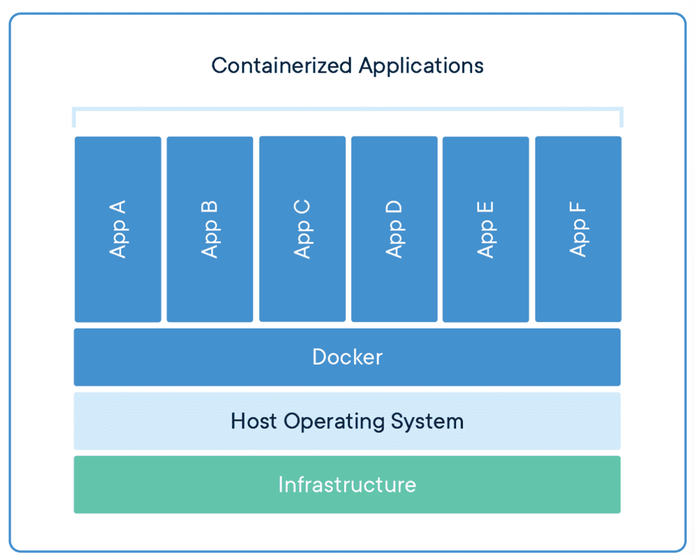
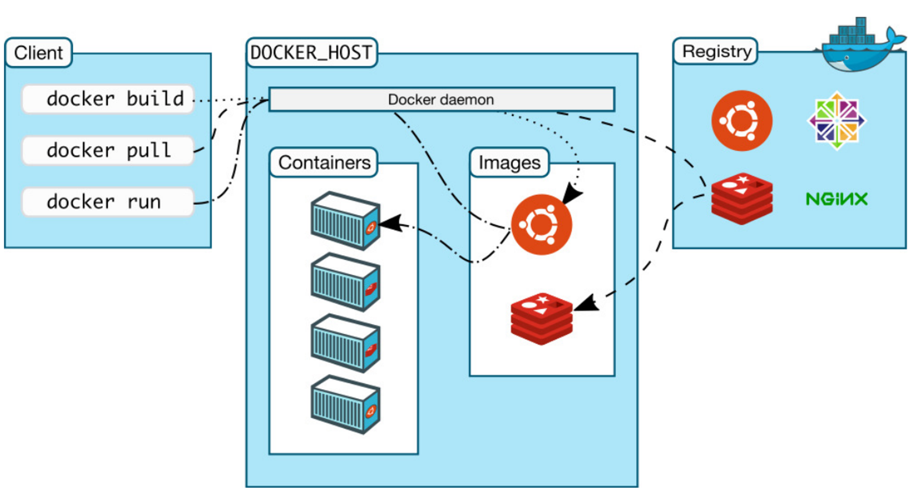
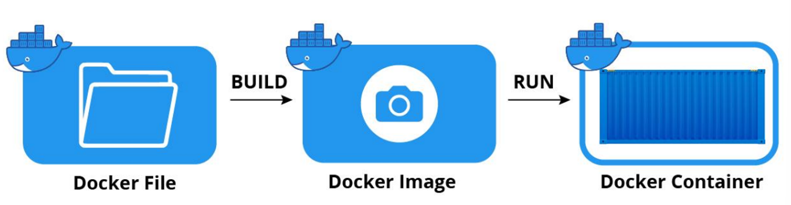

## Virtual Machine

처음에는 하나의 서버 당 하나의 애플리케이션이 동작됐다. 그래서 새로운 애플리케이션이 필요할 때마다 서버를 구매해야 하고, 무조건 성능과 규모가 좋은 것을 구매해아여 낭비가 심했다.



이후 가상 머신이라는 개념이 나왔다.

가상머신은 하이퍼바이저를 이용해 여러 개의 운영체제를 하나의 호스트에서 생성해 사용하는 방식으로 각 가상머신에 운영체제가 설치된다.

하이퍼 바이저는 호스트 시스템에서 다수의 게스트 OS를 설치 및 가동할 수 있게 하는 소프트웨어이다. 하드웨어를 가상화하고 하드웨어와 각각의 VM을 모니터링하는 중간 관리자라 할 수 있다.

> 가상화는 하나의 하드웨어를 여러 개의 가상 머신으로 분할해 효율적으로 사용하는 기술이다. 이때 기존의 환경을 Host OS, 가상 머신으로 분할된 각각의 영역을 Guest OS라고 부른다.


하이퍼 바이저는 네이티브형과 호스트형이 있다. 주로 호스트형을 많이 사용한다.



- 네이티브형
    - 하이퍼 바이저가 하드웨어를 직접 제어하여 자원을 효율적으로 사용 가능하다.
    - 별도의 OS가 없어 오버헤드가 적다.
    - 여러 하드웨어 드라이버를 세팅해야하므로 설치와 사용이 어렵다.
- 호스트형
    - 호스트 OS 위에서 실행되며, 하드웨어 자원을 VM 내부의 게스트 OS에 에뮬레이트하는 방식으로 오버헤드가 크가.
    - 게스트 OS 종류에 대한 제한이 없다.
    - 구현이 쉽다.

> 오버헤드: 프로그램의 실행흐름 도중에 동떨어진 위치의 코드를 실행시켜야 할 때, 추가적으로 시간, 메모리, 자원이 사용되는 현상이다.
에뮬레이트: 다른 프로그램이나 장치를 모방하는 컴퓨터 프로그램 또는 전자기기를 가리킨다.
>

가상 머신은 하나의 운영체제 위의 여러 OS를 실행 시켜 이전보다 낭비를 줄일 수 있지만, 다음과 같은 단점이 있다.

- 단점
    - 시스템 자원을 가상화하고 독립된 공간을 생성하는 작업이 하이퍼바이저를 거쳐야 하기 때문에 **성능 손실이 크다.**
    - 가상머신은 게스트 운영체제를 사용하기 위한 라이브러리, 커널 등을 포함하기 때문에 배포하기 위해 이미지로 만들었을 때 **이미지의 크기(용량)가 커진다.**

## Docker

도커는 가상화의 한 종류인 컨테이너를 이용해서 프로세스를 격리시켜주는 소프트웨어이다. 컨테이너는 VM의 목적과 같은 또다른 가상화 기술이다.

도커는 리눅스 컨테이너에 리눅스 어플리케이션을 더 쉽게 컨테이너로 실행하고 관리할 수 있게 해주는 오픈 소스 프로젝트이다. 일반적으로 도커 엔진 혹은 도커에 관련된 프로젝트를 도커라고 한다.

> Docker Engine: 도커 엔진은 컨테이너를 제어할 수 있는 도커의 프로젝트이다.
>

- Docker Container



하이퍼 바이저 기반 가상화 구조와 달리 각각의 격리된 환경에 OS가 포함되지 않는다. 호스트 OS의 커널을 공유하고 이미지를 배포하기만 하면 된다.

커널을 공유하며 격리된 환경을 구축할 수 있는 이유는 리눅스에서 제공하는 Cgroup과 namespaces를 사용하기 때문이다.

- Cgroup (Control group)
    - CPU, 메모리, Network Badwith 등 물리적 자원의 리소스 사용량을 관리할 수 있는 커널의 주요 기능이다.
    - 어플리케이션을 Cgruop에 넣어 CPU나 메모리 사용량을 제한해줄 수 있다.
- namespaces
    - 하나의 시스템에서 프로세스를 격리시킬 수 있는 가상화 기술이다.
    - 이 기능으로 독립된 공간을 사용하는 것처럼 격리된 환경을 구축할 수 있다.

가상화된 공간을 만들 때 도커 컨테이너는 리눅스 자체 기능을 사용하여 프로세스 단위의 격리 환경을 만들기 때문에 성능 손실이 거의 없다.

또한, 컨테이너에 필요한 커널을 공유해서 사용하기 때문에 컨테이너 안에는 어플리케이션을 구동하는 데 필요한 라이브러리 및 실행 파일만 존재한다.

- 가상 머신과 비교한 도커
    - 이미지 용량이 작다.
    - 컨테이너를 이미지로 만들어 배포하는 시간이 빠르다.
    - 가상화된 공간을 사용할 때 성능 손실이 거의 없다.

## Docker 구성요소



- Docker Client
    - 도커를 설치하면 Client에서 build, pull, run 등의 도커 명령어를 수행할 수 있다.
- Docker host
    - 도커가 띄어져있는 서버이다. 여기에서 컨테이너와 이미지를 관리한다.
- Docker daemon
    - 도커 엔진이다.
- Registry
    - 외부 이미지 저장소이다. 다른 사람들이 공유한 이미지를 내부 Docker host에 pull할 수 있고, 해당 이미지를 run하면 컨테이너가 된다.

## Docker Image & Docker Container

### Docker Image

도커 이미지는 도커 컨테이너를 생성할 때 필요한 요소이며, 여러 계층으로 된 바이너리 파일로 존재한다.

- 도커에서 사용하는 이미지의 이름 형태

    ```json
    [저장소 이름]/[이미지 이름]/[태그]
    ```

    - 저장소 이름
        - 이미지가 저장된 저장소이다.
        - 저장소 이름을 명시되지 않은 이미지는 도커 허브 공식 이미지를 뜻한다.
    - 이미지 이름
        - 이미지가 어떤 역할을 하는지 나타낸다.
        - 예시) ubuntu:latest ⇒ 우분투 컨테이너를 생성하기 위한 이미지
    - 태그
        - 이미지의 버전을 나타낸다.
        - 태그를 생략하면 도커 엔진은 latest로 인식한다.

### Docker Container

도커 컨테이너는 도커 이미지로 생성할 수 있다. 도커 이미지의 목적에 맞는 파일이 들어 있고, 호스트와 다른 컨테이너로부터 **격리된 시스템 자원 및 네트워크를 사용할 수 있는 독립된 공간**이 생성된다.

도커 컨테이너는 생성될 때 사용된 도커 이미지의 종료에 따라 설정과 파일을 갖고 있어서 이미지의 목적에 맞도록 사용되는 것이 일반적이다.

예시) 웹 서버 도커 이미지로  도커 컨테이너를 생성하면 웹 서버가 생성된다.

도커 컨테이너는 이미지를 읽기 전용으로 사용한다. 변경된 사항은 컨테이너 계층에 저장하여 원래 이미지에는 영향을 주지 않는다.

또한, 어플리케이션을 설치하거나 삭제해도 다른 컨테이너와 호스트는 변화가 없다.

- Docker Container 생성 과정



- Docker File → Docker Image
    - 도커 파일은 도커 이미지를 만들 때 사용하는 파일이다.
    - build 명령어를 실행시키면 도커 이미지를 만들 수 있다.
- Docker Image → Docker Container
    - 도커 이미지를 run 명령어를 실행시키면 도커 컨테이너를 만들 수 있다.

---

**출처**

[https://velog.io/@markany/도커에-대한-어떤-것-1.-도커란-무엇인가](https://velog.io/@markany/%EB%8F%84%EC%BB%A4%EC%97%90-%EB%8C%80%ED%95%9C-%EC%96%B4%EB%96%A4-%EA%B2%83-1.-%EB%8F%84%EC%BB%A4%EB%9E%80-%EB%AC%B4%EC%97%87%EC%9D%B8%EA%B0%80)

[https://seosh817.tistory.com/345#Virtual Machine(가상머신) vs Docker Container(도커 컨테이너)-1](https://seosh817.tistory.com/345#Virtual%20Machine(%EA%B0%80%EC%83%81%EB%A8%B8%EC%8B%A0)%20vs%20Docker%20Container(%EB%8F%84%EC%BB%A4%20%EC%BB%A8%ED%85%8C%EC%9D%B4%EB%84%88)-1)

[https://velog.io/@huurray/Docker-컨테이너-와-VM](https://velog.io/@huurray/Docker-%EC%BB%A8%ED%85%8C%EC%9D%B4%EB%84%88-%EC%99%80-VM)

https://gngsn.tistory.com/128

https://donggu1105.tistory.com/175

[https://namu.wiki/w/에뮬레이터](https://namu.wiki/w/%EC%97%90%EB%AE%AC%EB%A0%88%EC%9D%B4%ED%84%B0)
