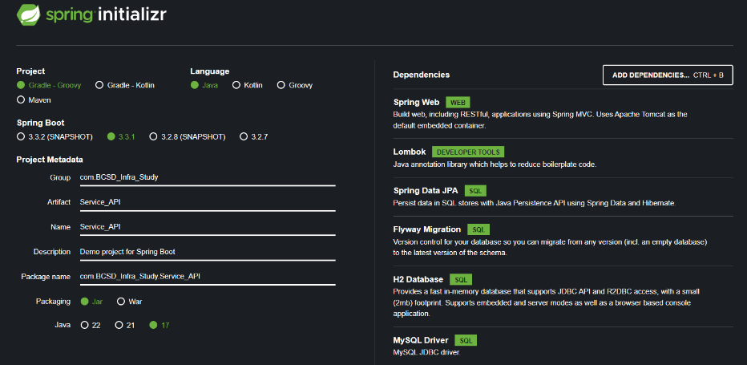
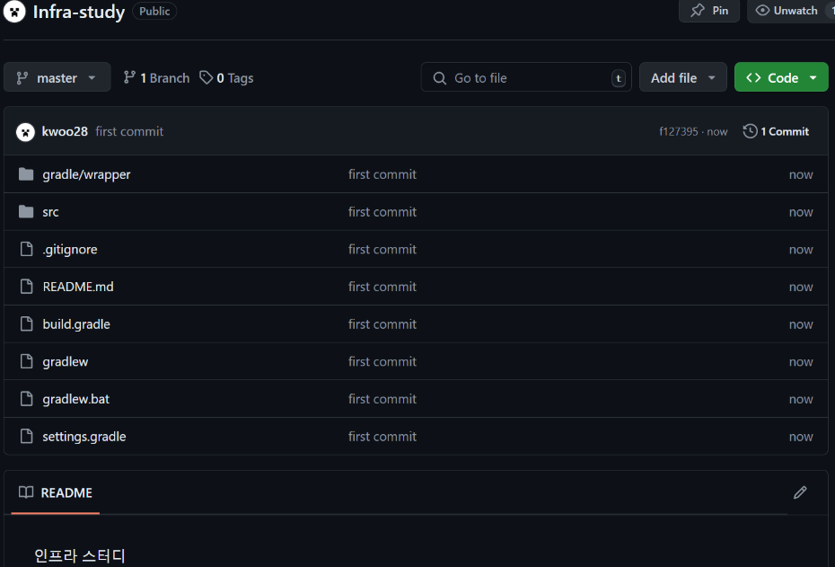
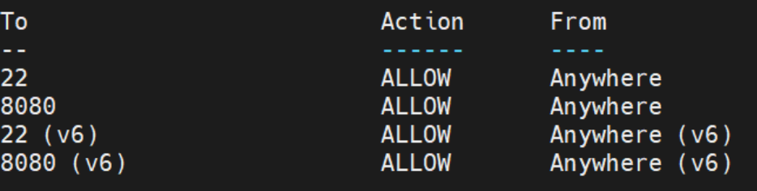
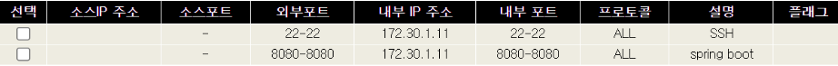
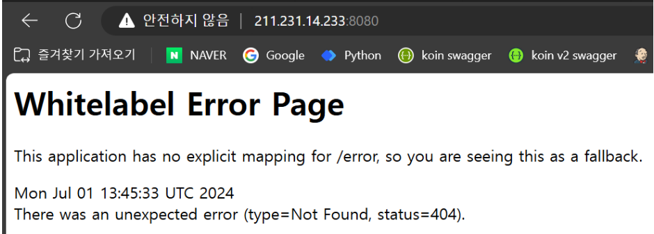
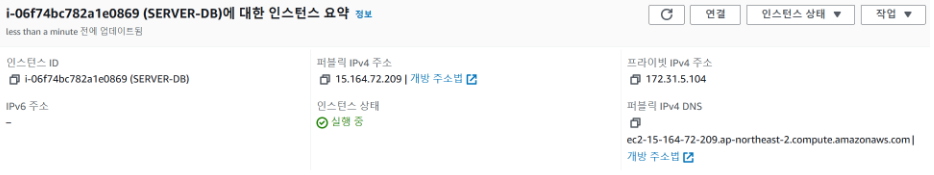

## application 인스턴스

1. 스프링 부트 프로젝트 생성



2. 깃 프로젝트 연동




3. 깃 설치
   Script : apt install git


4. 깃 클론
   Script : git clone https://github.com/kwoo28/Infra-Study
   source : /usr/local


5. jdk 설치
   Script : apt install openjdk-17-jdk
   source : /usr/lib/jvm


6. 한국시간 변경
   Script : sudo ln -sf /usr/share/zoneinfo/Asia/Seoul /etc/localtime


7. jar 빌드하기
   Script :  chmod +x gradlew -> ./gradlew clean build


8. 방화벽 8080 포트 허용하기
- Ubunut 서버 방화벽



Script : sudo ufw allow 8080

- KT 공유기 포트포워딩 설정




9. jar 배포하기
   8080포트로 모든 IP에서 접근 가능
   Script : java -jar build/libs/Service_API-0.0.1-SNAPSHOT.jar
   


## DB 인스턴스

1. AWS t2.micro EC2생성




2. 보안그룹에서 22, 3306포트 허용


3. Mysql 설치
   Script : sudo apt install mysql-server


4. Mysql 권한 설정 및 포트허용
   Script : CREATE USER 'root'@'%' IDENTIFIED BY '비밀번호’';
   GRANT ALL PRIVILEGES ON *.* TO 'root'@'%' WITH GRANT OPTION;
   FLUSH PRIVILEGES;
Script : sudo vi /etc/mysql/mysql.conf.d/mysqld.cnf
-> bind-address = 0.0.0.0으로 변경


5. ufw 3306포트 허용
   Script : sudo ufw allow mysql


HTTPS 인증

1. nginx 설치
   Script : sudo apt update
   -> sudo apt install nginx

2. certbot 설치
   Script : sudo snap install certbot --classic

3. 인증서 발급
   Script : sudo certbot --nginx -d 211.231.14.233.nip.io
   인증서 발급을 위해선 도메인을 사용해야하는데, IP뒤에 .nip.io를 붙이면 도메인대용으로 쓸 수 있다.

4. https설정 및 리다이렉트
   source : /etc/nginx/sites-available/default

```
server {
listen 443 ssl;
server_name 211.231.14.233.nip.io;

        location / {
                proxy_set_header X-Forwarded-For $proxy_add_x_forwarded_for;
                proxy_set_header X-Forwarded-Proto $scheme;
                proxy_set_header X-Real-IP $remote_addr;
                proxy_set_header Host $http_host;

                proxy_pass http://localhost:8080;
        }

        ssl_certificate /etc/letsencrypt/live/211.231.14.233.nip.io/fullchain.pem;
        ssl_certificate_key /etc/letsencrypt/live/211.231.14.233.nip.io/privkey.pem;
        include /etc/letsencrypt/options-ssl-nginx.conf; # managed by Certbot
        ssl_dhparam /etc/letsencrypt/ssl-dhparams.pem; # managed by Certbot

}

server {
listen 80 ;
server_name 211.231.14.233.nip.io;

        # http로 요청이 오면 https로 리다이렉트
        return 301 https://$server_name$request_uri;
```


## 젠킨스 STAGE/PROD 서버 빌드 배포 과정
1. GitHub PR 생성 및 빌드/테스트
Repository: KOIN_API_V2
Branch: main 또는 develop
Action: PR 생성 시 Git Action에서 빌드 및 테스트 수행


2. PR이 develop 브랜치에 머지될 경우
트리거: BCSD_Build 서버의 Jenkins에서 빌드 트리거 유발


3. 파일 복사
Source: ~/deploy/api-koin-v2-stage/config/*
Destination: ${WORKSPACE}/src/main/resources/


4. Docker 이미지 빌드 및 푸시
Script: /usr/local/koin_api_stage/build.sh
Action-1 : 사용되지 않는 이미지를 삭제하고, 종료된 컨테이너를 삭제
Action-2 : 실험적인 기능을 활성화하는 환경 변수 설정
Action-3 : mymultiarchbuilder라는 이름의 buildx 빌더를 생성하고, 이를 현재 세션에서 사용 *buildx :  멀티 아키텍처 이미지를 빌드할 수 있는 도구
Action-4 : 방금 생성한 buildx 빌더를 초기화하고 필요한 설정을 적용하는 부트스트랩 적용
Action-5 : docker hub 로그인
Action-6 : linux/amd64와 linux/arm64아키텍쳐를 지원하는 bcsd/koin-api-stage:latest와 bcsd/koin-api-stage:$(date +%Y%m%d%H%M)라는 두개의 이미지의 이름으로 빌드하고 Docker hub에 Push함
Action-7 : linux/amd64아키텍처를 지원하는 bcsd/koin-api-stage:latest라는 이름의 이미지로 빌드하고 현재 서버호스트 이미지에 올려놓음.


5. 각 서버에서 Docker 이미지 Pull
Script: /usr/local/koin_api_stage/deploy.sh
대상 서버:
BCSDLAB_INTERNAL (ubuntu@43.202.254.112)
KOIN_STAGE (tomcat@43.200.206.36)
KOIN_PROD (tomcat@52.78.46.60)
Action : 각 3개의 서버에서 /usr/local/koin_api_stage의 경로에 있는 deploy.sh 명령어 실행 -> 사용되지 않는 이미지를 삭제하고, 종료된 컨테이너를 삭제한 후에 docker hub에서 방금 push한 bcsd/koin-api-stage:latest이미지 Pull


6. 매니저 노드에서 롤링 업데이트
Node: KOIN_DB (54.180.57.106)
Script: /usr/local/koin_api_stage/deploy.sh
Action: spring-stage-container 서비스 롤링 업데이트
