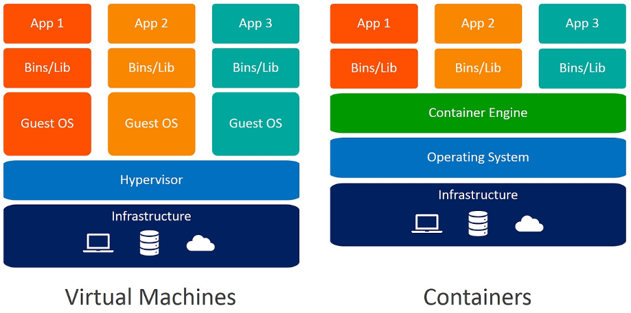
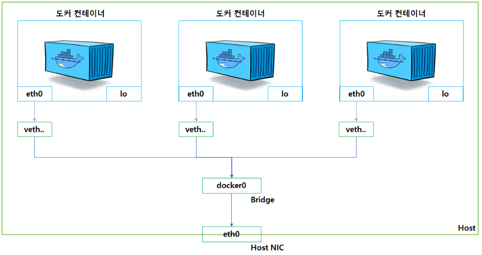

## 도커(Docker)란?

도커는 어플리케이션이 개발환경에서 분리되어 하나의 운영체제의 커널을 공유하며 여러 컨테이너 기반 형식으로 실행 되는 오픈 플랫폼이다. 응용프로그램을 실행할 때 여러 라이브러리나 버전 등을 세팅하지 않고도 간편하게 컨테이너만을 공유하며 일관된 응용 프로그램을 실행 할 수 있어, 개발 환경에 종속되지 않고 일관된 응용 프로그램을 유지 할 수 있으며, 각 컨테이너마다 cpu나 메모리 사용량을 설정할 수 있어 유연한 스케일링이 가능하다.

또한 가상머신과 다르게 여러 컨테이너가 같은 커널의 자원을 공유하기 때문에 매우 가벼워 도커에서 빠르고 간편하게 컨테이너를 운영할 수 있다.


## 가상머신과 도커 차이

가상머신과 도커는 응용프로그램을 분리한다는 점에서 유사하지만, 크게 운영체제 커널 공유 유무에 따라 차이점이 있다.

가상머신은 호스트 운영체제 위에 새로운 운영체제를 갖는 가상머신을 생성하여 완전히 독립된 운영체제 환경을 갖게되지만 생성할때마다 매우 무겁다.

하지만 도커는 각 컨테이너를 생성하여 독립된 환경을 갖으면서 운영체제 커널을 공유하여 가볍고 빠르게 관리할 수 있다. 하지만 만약 하나의 컨테이너에서 커널에 영향을 주게된다면 다른 컨테이너까지 영향을 받게된다는 단점이 존재한다.


## 도커를 사용하는 이유

1. 빠르고 일관된 애플리케이션 제공
   Docker는 컨테이너를 이용하여 표준화된 환경에서 작업할 수 있도록 하여 개발 라이프사이클을 간소화 할 수 있다. 예를들어 개발자가 로컬 개발환경에서 코드 작성하고 도커 컨테이너로 패키징하여 공유를 하면, 다른 개발자가 공유된 컨테이너를 이용하여 각자 개발 환경마다 다른 운영체제나 라이브러리 버전에 상관없이 일관된 개발 환경을 갖고 개발 할 수있다.

2. 격리된 환경
   도커는 각 컨테이너를 격리된 환경으로 실행하므로, 하나의 컨테이너에서 발생한 문제가 커널에 영향을 주지 않는 이상 다른 컨테이너에 영향을 주지 않는다. 또한 Mysql같은 서버를 2개의 버전으로 하나의 개발 환경에서 동시에 실행이 가능하다.

3. 더 많은 작업 실행 가능
   가상머신에 비해 자원을 효율적으로 사용하므로 서버 용량을 더 많이 사용하여 비즈니스 목표를 달성할 수 있다. 그렇기때문에 고밀도 환경과 더 적은 리소스로 더 많은 작업을 수행해야 하는 소규모 및 중규모 배포에 적합하다.

4. 스케일링 가능
   컨테이너의 자원을 제한하거나 확장하여 유연한 리소스 관리가 가능하다.

5. 네트워크 환경 구성
   도커에서 네트워크 환경을 구성하여 컨테이너 간의 통신을 설정할 수 있으며, 호스트와 컨테이너의 포트 매핑을 설정할 수있다.


## 도커 사용법
1. Dockerfile에 컨테이너 생성에 대한 정보를 세팅한다.
2. Dockerfile을 빌드하여 이미지를 생성한다.
3. 생성된 이미지를 바탕으로 컨테이너를 구동한다.

* 도커 이미지 *
  도커 이미지는 응용 프로그램을 실행하는데 필요한 여러 설정을 포함하는 불변의 읽기 전용 파일이다. 컨테이너를 실행할 때는 도커이미지를 바탕으로 읽고 쓸 수 있는 복사본을 생성하여 구동된다.


## 도커 볼륨
도커 컨테이너는 독립된 공간이기때문에 만약 도커 컨테이너를 구동한 후에 데이터를 추가 및 수정하고 나서 컨테이너를 삭제하게 될 시 지금까지 해왔던 데이터들이 사라지게 될것이다. 이런 상황을 방지하기 위해 호스트서버와 도커컨테이너의 데이터를 공유할 수 있게 도커는 기능을 제공해주고 있다.


컨테이너의 데이터를 공유할 수 있게 해주는 기능은 3가지가 있다.

1. 호스트 볼륨 이용하기
2. 볼륨 컨테이너 이용하기
3. 도커 볼륨 이용하기

일단 볼륨이란 도커 컨테이너에서 데이터를 저장하고 공유하기 위한 디렉터리 또는 파일이다. 여러 컨테이너에서 공유할 수 있으며, 데이터가 컨테이너가 삭제되더라도 유지될 수 있다. 그렇기때문에 컨테이너에서 데이터가 지속적으로 변경될 수 있는 데이터베이스와 같은 상태 저장 애플리케이션에서 많이 쓰인다.

1. 호스트 볼륨 이용하기
   호스트의 디렉토리를 컨테이너의 디렉토리와 연결하는 작업이다. 컨테이너에서 파일의 변경이 생기면 호스트의 디렉토리에도 자동으로 변경된다.

```bash
$ docker run
--name [컨테이너 이름] [이미지 이름]
-v [호스트 공유 디렉토리]:[컨테이너 공유 디렉토리]
위 스크립트에서 만약 호스트 공유 디렉토리가 없으면 자동으로 디렉토리를 생성해준다.
```

2. 볼륨 컨테이너 이용하기
   볼륨 컨테이너를 이용하는 방식은 -v 옵션이 아닌 --volumes-from 옵션을 사용하여 볼륨을 사용하는 A컨테이너의 볼륨을 다른 B컨테이너와 공유를 하게한다.
   스크립트를 예시로 들자면 아래 상황과같이 쓰일 수 있다.

```bash
$ docker run -d -it
--name volume_override
-v usr/html:/usr/share/nginx/html
ubuntu:14.0.4

$ docker run -d \
--name nginx-container-1
--volumes-from volume_override
-p 8080:80
nginx


$ docker run -d \
--name nginx-container-2
--volumes-from volume_override
-p 8080:80
nginx
위 스크립트와같이 nginx-container-1컨테이너와 nginx-container-2컨테이너가 서로 volume_override 컨테이너의 볼륨을 공유하고 있다.
```

3. 도커 볼륨 이용하기
   도커 볼륨은 도커에서 제공하는 볼륨 관리 기능이다. 호스트 볼륨과의 차이점은 호스트에 마운트할 경로를 지정했어야 했지만, 도커 볼륨은 도커가 제공하는 볼륨 관리 기능을 통해서 볼륨을 생성하고 삭제하고 관리를 할 수 있다.
```bash
$docker volume create {볼륨 이름}

위와 같은 스크립트를 통해 볼륨을 생성하고 나면 기본적으로 /var/lib/docker/volumes/{볼륨이름}/_data 디렉터리에 데이터가 저장되게 된다. 그 후에 호스트 디렉토리 연결하듯이 CLI를 사용하면 된다.

$docker run -v {볼륨 이름}:{컨테이너 내부 디렉토리 경로} --name {컨테이너 이름} {이미지 이름}
```

## 도커 네트워크
도커 네트워크란 Docker 컨테이너 간의 통신을 관리하고 격리하기 위한 기능을 제공하는 것이다.

위 사진과 같은 네트워크 구조를 갖고있다.

- eth0
  eth0는 도커 컨테이너 내에서 자동으로 생성되는 기본 네트워크 인터페이스이다. 이 인터페이스는 외부에 접근할 수 있도록 컨테이너가 시작될때 각 컨테이너마다 eth0에 IP주소를 할당한다. 기본적으로 도커는 컨테이너에 172.17.0.X부터 순차적으로 할당해준다.
- veth
  veth는 리눅스에서 가상 이더넷 장치를 나타낸다. veth는 항상 쌍으로 존재한다. 하나의 veth 인터페이스는 호스트 시스템에 연결되고 다른 하나는 컨테이너의 eth0에 연결되어, 한 쪽에서 발생한 트래픽이 자동으로 다른 쪽으로 전달되어 컨테이너가 외부 네트워크 또는 다른 컨테이너와 통신할 수 있도록 도와준다.

- Bridge
  docker0는 포트를 연결해 외부에 노출시켜 주는 역할을 한다. 즉, veth 가상 인터페이스와 호스트의 인터페이스를 연결해줘서 도커 컨테이너가 외부와의 통신을 할 수 있도록 이어주는 다리 역할을 해준다.

Bridge는 따로 생성할 수 있으며, 컨테이너 실행할때 따로 Bridge를 지정하지 않으면 도커에서 docker0를 기본적으로 연결한다.
