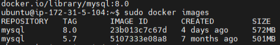
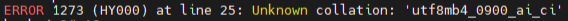

## 1. DB 서버 Docker 설치

1. 우분투 시스템 패키지 업데이트<br>
   Script: sudo apt-get update


2. 필요한 패키지 설치<br>
   Script: sudo apt-get install apt-transport-https ca-certificates curl gnupg-agent software-properties-common


3. Docker의 공식 GPG키 추가<br>
   Script: curl -fsSL https://download.docker.com/linux/ubuntu/gpg | sudo apt-key add -


4. Docker의 공식 apt 저장소 추가<br>
   Script: sudo add-apt-repository "deb [arch=amd64] https://download.docker.com/linux/ubuntu $(lsb_release -cs) stable"


5. 시스템 패키지 업데이트<br>
   Script: sudo apt-get update


6. Docker 설치<br>
   Script: sudo apt-get install docker-ce docker-ce-cli containerd.io
   - docker-ce : Docker Engine을 포함하는 도커의 기본 기능을 제공해 주는 패키지
   - docker-ce-cli : Docker Engine에 명령을 보내는 패키지
   - containerd.io : 컨테이너 실행을 담당하는 런타임 패키지


7. Docker 설치 확인<br>
   sudo systemctl status docker


## 2. Mysql 이미지 설치
Script-1: sudo docker pull mysql:5.7<br>
Script-2: sudo docker pull mysql:8.0<br>

5.7과 8.0 두개의 버전에 대한 mysql 이미지를 설치한다.<br>



## 3. Mysql 볼륨 생성
Script-1: sudo docker volume create mysql-5.7-volume<br>
Script-2: sudo docker volume create mysql-8.0-volume<br>

호스트에서 mysql 데이터를 접근할 수 있는 볼륨을 임의로 지정하여 생성한다.
(굳이 볼륨을 생성하지 않아도 자동으로 생성되지만 알아보기 힘든 긴 영어와 숫자가 혼합된 랜덤 이름으로 생성되기 때문에 알아보기 쉬운 이름으로 볼륨을 생성하여 사용하는 것이 좋다.)


## 4. Mysql 컨테이너 실행
Script-1: sudo docker run --name mysql-5.7-container -e MYSQL_ROOT_PASSWORD={비밀번호} -v mysql-5.7-volume:/var/lib/mysql -p 3307:3306 -d mysql:5.7<br>

Script-2: sudo docker run --name mysql-8.0-container -e MYSQL_ROOT_PASSWORD={비밀번호} -v mysql-8.0-volume:/var/lib/mysql -p 3308:3306 -d mysql:8.0


## 5. 기존 Mysql서버 dump 뜨기
Script: mysqldump -u root -p service > /home/ubuntu/mysql-2024-07-27-04-39.sql<br>
기존의 mysql에 있던 데이터들을 새로 생성한 mysql 5.7과 8.0 컨테이너에 옮기기 위해 dump를 뜬다.

## 6. dump파일 복사
Script-1: sudo cp /home/ubuntu/mysql-2024-07-27-04-39.sql /var/lib/docker/volumes/mysql-8.0-volume/_data/

Script-2: sudo cp /home/ubuntu/mysql-2024-07-27-04-39.sql /var/lib/docker/volumes/mysql-5.7-volume/_data/
#에러 발생#<br>
<br>
mysql 8.0에 있던 dump를 5.7컨테이너에 import 하는 과정에서 지원하지 않는 정렬 규칙으로 에러가 발생했다. 그래서
```sed -i 's/utf8mb4_0900_ai_ci/utf8mb4_general_ci/g' /var/lib/mysql/mysql-2024-07-27-04-39.sql```
명령어를 사용하여 mysql 5.7버전에서 지원하는 정렬 규칙으로 변경 후 정상적으로 import하였다.

dump뜬 파일을 도커 볼륨에 복사한다. 이유는 도커 컨테이너에선 호스트의 파일을 참조할 수 없기 때문에 볼륨에 복사해놓고 컨테이너에서 dump파일을 import를 해야한다.


## 7. application.yml DB포트 변경
이제 DB는 도커를 이용할 예정이기에 기존에 연결하던 mysql서버를 끊고, 새로 생성한 mysql 컨테이너에 연결해야한다.

```
datasource:
driver-class-name: com.mysql.cj.jdbc.Driver
url: jdbc:mysql://15.164.72.209:3306/service
```
여기서 포트를 3306 -> mysql:8.0컨테이너인 3308로 변경하고, 프로세스 종료 후 다시 빌드 배포를 한다.