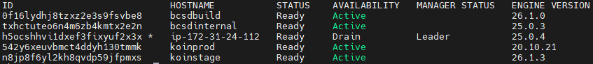
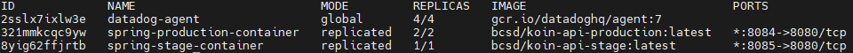
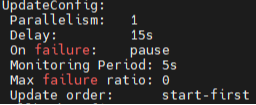
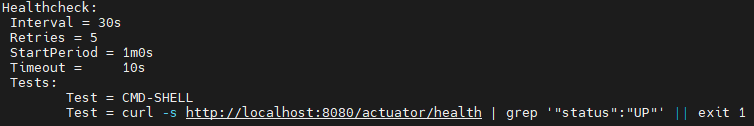
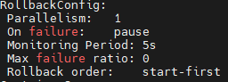

# 도커 스웜
도커 스웜은 도커의 클러스터 관리 기능으로, 여러 대의 도커 호스트를 마치 하나의 호스트처럼 사용하여 컨테이너를 관리하는 도구이다. 클러스터 내의 서비스에 대한 요청을 자동으로 분산시켜, 각 컨테이너에 고르게 트래픽을 분산시켜 주는 역할을 해준다.

# 도커 스웜 개념
##  1. 노드 
클러스터 내의 각 PC를 노드라고 한다. 노드는 매니저 노드와 워커 노드로 나뉜다. 매니저 노드는 클러스터의 상태를 관리하고 작업을 분배하며, 워커 노드는 매니저로부터 받은 작업을 실행하게 된다.

현재 코인의 매니저 노드는 DB인스턴스이며, 나머지 4개의 인스턴스는 워커 노드로 사용하고 있다.

## 2. 서비스
서비스는 도커 이미지를 기반으로한 기본 배포 단위이다. 우리가 도커스웜을 하기 전엔 애플리케이션을 배포하기 위해선 컨테이너를 구동시켰는데, 도커스웜에선 애플리케이션을 배포하기 위해 컨테이너의 묶음인 서비스를 구동하게된다.

그렇기때문에 서비스는 도커 이미지, 포트, 볼륨 등을 정의하고, 어떤 노드에서 해당 컨테이너를 실행시킬 것인지 결정하는 역할을 한다. 또한, 서비스는 해당 애플리케이션을 구동시키기 위해 몇개의 컨테이너를 이용할 것인지를 정의한다.

## 3. 레플리카
도커 스웜에서 레플리카는 특정 서비스의 인스턴스를 가리킨다. 서비스를 생성하거나 업데이트할 때, 해당 서비스의 레플리카 수를 지정할 수 있다. 위에 서비스 개념 설명할때 서비스는 해당 애플리케이션을 구동시키기 위해 몇개의 컨테이너를 이용할 것인지 정의한다고 말했었는데, 이 부분이 레플리카의 개수를 의미한다.

간단하게 말해서, 해당 서비스의 레플리카가 3개라면 구동되는 컨테이너는 3개라는 의미이다.

각 서비스의 트래픽을 고려해서 레플리카의 개수를 정해서 클러스터 내에서 적절하게 로드밸런싱을 할 수 있다. 예를들어 서비스가 여러개 있을때, 각 서비스의 트래픽을 고려해서 레플리카 개수를 조절하여 트래픽을 적절하게 분산시켜준다.

현재 코인은 production서비스는 2개의 레플리카, stage서비스는 1개의 레플리카를 이용하고 있다.

#  스웜 기능
## 1. 배포
서비스의 이미지를 변경하고자 할때 롤링 업데이트를 하게된다. 이러한 롤링 업데이트 기능을 이용해서 서비스를 중단하지 않고 무중단배포를 할 수 있다. 롤링 업데이트는 서비스를 생성할 때, 롤링 업데이트의 주기, 업데이트를 동시에 진행할 컨테이너의 개수, 업데이트에 실패했을 때 어떻게 할 것인지를 설정할 수 있다.

현재 spring-production-container 서비스의 롤링 업데이트 설정이다.
Parallelism은 업데이트할때 한번에 수행할 레플리카 개수이다.
Delay는 업데이트의 시간 간격이다.
On failure은 만약 업데이트가 실패할때 어덯게 할 것인가이다.
Update order같은 경우는 기존의 컨테이너를 중지한 후 새로운 컨테이너를 시작할것인지, 새로운 컨테이너를 먼저 시작한 후, 기존의 컨테이너를 중지할것인지 정 할 수 있다.

그래서 현재 코인은 2개의 레플리카중에서 1개씩 15초의 주기로 start-first전략으로 롤링업데이트를 하고 있다.

## 2. 헬스체크
도커 스웜은 해당 컨테이너가 잘 작동하는지 확인해주는 기능을 제공한다.

현재 코인은 위와같은 헬스 체크를 이용하고 있다.

### 2-1. Tests
“curl -s http://localhost:8080/actuator/health | grep '\"status\":\"UP\"' || exit 1” 은 헬스 체크를 수행할 명령어를 지정한다. localhost:8080/actuator/health 에 요청을 보낸후 응답에서 "status":"UP"이라는 문자열을 찾는다.

만약 UP상태가 아니면 exit code 1로 종료하여, 헬스 체크 실패로 간주한다. 컨테이너는 헬스 체크를 통해 컨테이너가 정상적으로 동작하는지 확인이 가능하지만, was자체에선 확인이 불가능하기때문에 Spring Actuator를 이용하여 놓치는 부분 없이 헬스체크를 할 수 있게된다.

### 2-2. Interval
헬스 체크를 수행하는 간격을 30초로 설정하여, 매 30초마다 헬스 체크를 실행한다.

### 2-3. Timeout
헬스 체크 명령어가 실행되는 최대 시간을 10초로 설정하여, 이 시간 내에 응답이 없으면 헬스 체크로 간주되지 않게한다. 10초 이상은 서비스에 문제가 발생했을 가능성이 높기때문에 실패로 간주하여 문제를 감지하고 조치하는 것으로 추측된다.

### 2-3. Retries
헬스 체크가 실패했을 경우, 최대 5번까지 재시도하도록 설정하여, 5번의 재시도 후에도 실패하면 서비스가 비정상으로 간주한다.

### 2-4 . StartPeriod
컨테이너의 초기화 시간을 고려하여, 컨테이너가 시작된 후 60초 동안 헬스 체크를 수행하지 않는 기능을 해준다.

## 3. 롤백
도커 스웜은 롤백 기능을 제공한다. 롤백은 업데이트를 취소하고 이전 상태로 되돌리는 기능이다.

현재 코인의 spring-production-container서비스는 위와 같은 상태이다.
### 3-1. Parallelism
롤백을 수행할 때 한 번에 동시에 처리할 수 있는 컨테이너의 수를 설정한다.
현재 한 번에 하나의 컨테이너만 롤백을 진행하고 있다.

### 3-2. On failure
현재 코인은 롤백 과정 중에 오류가 발생하면 롤백을 중단하고 일시 정지한다.

### 3-3. Monitoring Period
롤백 후 각 태스크의 상태를 모니터링하는 기간을 설정한다. 현재 코인은 롤백된 컨테이너의 상태를 5초 동안 모니터링한다.

### 3-4. Max failure ratio
롤백 과정 중 허용되는 최대 실패 비율을 설정한다. 현재 코인은 0으로 설정되어 있으므로, 롤백 중에 실패하는 태스크가 하나라도 발생하면 롤백을 중단하고 있다.

### 3-5. Rollback order
현재 롤백 과정에서 먼저 새로운 버전의 컨테이너를 시작한 후, 기존의 컨테이너를 중지하고 있다.
