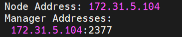
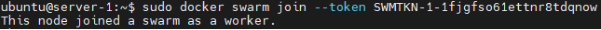
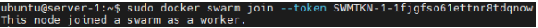
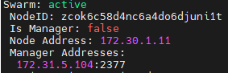
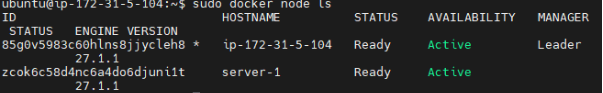
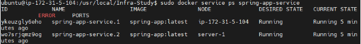
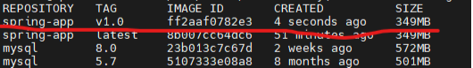
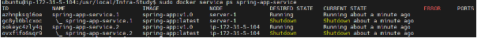
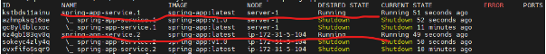
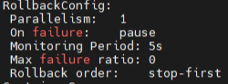

## 1. DB가 설치된 인스턴스에 도커스웜 시작하기
현재 인스턴스에 예전 도커라이즈할때 도커 엔진이 포함된 docker-ce를 설치한적이 있었다. 도커 엔진은 도커스웜 기능을 포함하고 있기때문에, 스웜모드를 바로 시작할 수 있다. 도커스웜 모드를 시작하면 자동으로 현재 인스턴스가 매니저노드로 시작하기 때문에, 어떤 인스턴스를 매니저노드로 둘 것인지 정해야한다.

나같은 경우는 DB서버가 있는 인스턴스와 WAS와 Nginx가 있는 인스턴스중에 어떤 인스턴스를 매니저노드로 둘 것인지 정해야했는데, DB서버가 있는 인스턴스를 매니저노드로 둘 예정이다. 현재 인스턴스가 2개밖에 없기때문에 뭘 하든 비슷하겠지만, 만약 추후 WAS서버의 트래픽 관리를 위해 인스턴스를 더 생성한다면, 해당 인스턴스들과 DB인스턴스의 관계는 N:1이 되기때문에 DB서버를 매니저 노드로 둘 것이다.

일단 도커스웜을 시작하기 전에 방화벽에 4개의 포트 허용을 해주어야한다.

TCP 2377: Swarm 관리를 위한 매니저 노드 통신
TCP 7946: 노드 간의 상태 및 관리 정보를 교환
UDP 7946: 노드 간의 상태 및 관리 정보를 교환
UDP 4789: Overlay 네트워크에서 컨테이너 간의 실제 데이터 패킷을 전송

Script: sudo docker swarm init

위와같이 명령어를 쓰면 자동으로 현재 인스턴스가 스웜모드를 시작하면서 매니저 노드로 시작하고, 노드 IP를 자동으로 할당해준다.

docker info 명령어를 이용하여 현재 노드 IP와 매니저IP에 대한 정보가 뜬 것을 확인 할 수 있다.  현재 뜬 매니저노드의 주소와 포트를 통해 클러스터 관리에 사용할 수 있다.

## 2. 워커 노드로 스웜에 가입하기
아까 sudo docker swarm init 명령어 이후 워커노드에 가입하기 위해 docker swarm join --token SWMTKN-1-1fjgfso61ettnr8tdqnowcwm5g0w4uba7ynedh36lkvxa0ubxv-0xhg0fvckq538qtypvttf0olt 172.31.5.104:2377
명령어를 입력하라는 메시지가 출력되었다. 그래서 나는 해당 명령어에서 IP주소만 공인 IP주소로 바꾸어서 워커노드로 사용할 인스턴스에 붙여넣기하였다.

 

정상적으로 워커노드로 가입된 것을 볼 수 있다.

매니저 노드에서도 docker node ls로 워커노드가 가입된 것을 확인할 수 있다.

## 3. WAS 서비스 생성
이제 WAS서버를 위한 Service를 생성해야한다. 나는 현재 노드가 2개이기때문에 2개를 전부 활용하기 위해 레플리카를 2개 두어 각각의 노드에서 트래픽을 분산 시킬 것이다.

sudo docker service create \
--update-delay 20s
--name spring-app-service \
--replicas 2 \
--publish 8080:8080 \
spring-app:latest

--name: 생성할 service의 이름
--update-delay: 업데이트되는 레플리카의 시간 간격
--replicas: 생성할 컨테이너 개수
--publish: {외부포트}:{내부포트}
기반이미지

나는 위와 같은 명령어를 사용하여 jar파일로 빌드된 spring-app이미지를 기반으로 8080포트로 열어 레플리카를 2개 활용했다.

각 노드마다 컨테이너가 1개씩 실행되어 클러스터에서 서비스가 운영중임을 확인할 수 있다.

## 4. 도커스웜 업데이트
도커스웜은 롤링 업데이트를 통해 무중단배포를 이용할 수 있게한다.

위 사진은 현재 존재하는 이미지인데, 기존 spring-app:latest이미지를 기반으로 실행중인 서비스에서 spring-app:v1.0으로 업데이트 할 예정이다. 업데이트 하기 전에는 서비스의 레플리카가 할당 될 수 있는 노드에 업데이트 하려는 이미지는 전부 빌드 되어야 한다.

sudo docker service update --image spring-app:v1.0 spring-app-service
명령어를 이용하여 업데이트를 할 수 있다.

새로운 이미지가 업데이트 된 것을 볼 수있다. 참고로 업데이트 되는 과정을 실시간으론 캡쳐하지 않았지만, 서비스 생성할때 설정한 --update-delay 20s로 돼있기때문에 20초 간격으로 업데이트 되었다.

## 5. 도커스웜 롤백
도커스웜의 롤링 배포를 통한 무중단 배포 이외에 추가적인 장점은 롤백 기능이 있다는 것이다.
이번엔 이전 버전인 spring-app:latest를 스웜 롤백 기능을 통해 복구 해볼 예정이다. sudo docker service ps <서비스이름> 명령어를 통해 이미지 변경 기록을 확인 할 수 있는데, 이러한 변경 기록을 남기기때문에 롤백이 가능한 것이다.

하지만 docker info의 Task History Retention Limit 값에 의해 히스토리 보관 수량이 결정되는데, 이 값은 설정을 통해 조절 할 수 있다.

docker swarm update --task-history-limit 3

위 같은 명령어를 이용하여 히스토리 보관 수량을 조절 할 수 있다.

롤백은 docker service rollback <서비스이름> 명령어을 통해 이전 버전으로 롤백이 가능하다.

sudo docker service rollback spring-app-service 명령어를 통해 위 사진과 같이 이전 버전으로 롤백된 것을 확인 할 수 있다. 

현재 롤백 설정은 위와 같이 되어있는데, 이것 또한 docker service update <설정필드> <설정값> <서비스이름> 명령어를 통해 update처럼 delay시간을 조절 할 수 있다.