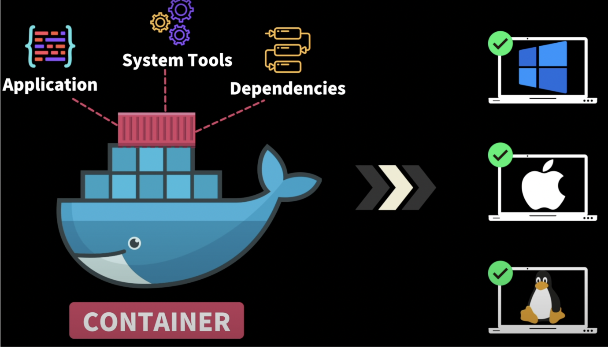
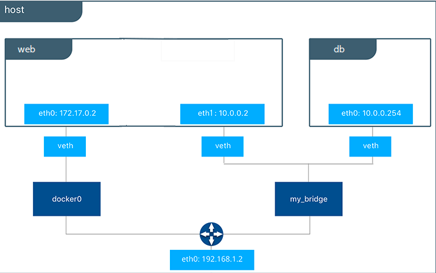

# 도커?

도커(Docker)는 *컨테이너 기반 가상화 플랫폼으로, 응용 프로그램과 이에 대한 종속성을 격리된 환경인 컨테이너로 패키징 하여 실행하는 기술이며 구축, 배포, 실행 및 업데이트를 관리할 수 있게 해주는 오픈 소스 플랫폼
→ 컨테이너 : 가상화 기술을 이용하여 어플리케이션/개발 환경을 격리 공간에서 실행하는 단위를 말함

아래 그림처럼, 모든 OS에서 호환되도록 만들어주는 기술

## 도커와 AWS

AWS에서의 Docker 설명 글이 있어서 연관지어봤음

- AWS에서 Docker 실행시 개발자와 관리자가 매우 안정적/저렴한 App 구축 및 제공 가능
- AWS에서 지원하는 AWS Fargate/ECS/EKS/Batch와 같이 연동해서 사용하면 Docker 컨테이너를 대규모로 실행하고 관리할 수 있음
- AWS에서의 Docker 사용의 강점으로 내놓은 것은 4가지가 있음
- 많은 SW를 더 빨리 제공 : 미사용자보다 7배 더 많은 SW를 제공할 수 있음
- 운영 표준화 : 작은 컨테이너식 App을 손쉽게 배포, 문제 파악 및 롤백 가능
- 원활한 이전 : Docker 기반 App을 로컬 개발할 시 AWS의 프로덕션 배포로 원활한 이전 가능
- 비용 절감 : Docker 컨테이너를 사용시 각 서버에서 사용률 증가 및 비용 절감 가능

## 도커와 가상머신의 차이

### 가상 머신

- 동일 OS에서 *hypervisro라는 가상머신을 만들어 구동시킴
  → hypervisro : 단일 물리적 머신에서 여러 가상 머신을 실행하는데 사용하는 SW
- OS위에서 App은 각각의 고립된 다른 환경에서 구동
- OS를 포함하기에 많이 무겁고 리소스가 많이 소요
- 이떄 하이퍼바이저에 생성되고 관리되는 OS는 Guest OS라고 하며, 이는 완전히 독립된 공간과 시스템 자원을 할당받아 사용. VMware 같은 툴이 있음

→ 이러한 특징을 통하여, 독립 공간을 생성하는 과정에서 큰 성능 손실을 가지고
→ 라이브러리와 커널들을 포함하는 과정에서 배포할 때 큰 용량을 차지한다는 단점을 가짐

### 도커

- Container Engine이 Host OS에 접근해 필요한 작업을 함
- Engine만 설치하면 컨테이너를 만들어서 고립화, OS를 포함하지 않음!
- 리눅스 자체 기능의 chroot, namespace, cgroup
  → chroot : 특정 디렉토리 경로를 root로 지정하여 환경을 분리하는 것
  → namespace : 프로그램에서 사용되는 이름의 논리적인 그룹의 식별자 컨텍스트
  → cgroup : 프로세스들의 자원 사용(CPU, 메모리, I/O, 네트워크)을 제한하고 격리시키는 것

→ overhead : 어떤 처리를 하기 위해 들어가는 간접 처리되는 시간/메모리
위 그림에서 보면 Docker Engine을 이용하면, OS를 사용하지 않고도 처리할 수 있음

## 도커의 3대 구성 요소

컨테이너를 만들기 위해서는 2번의 단계를 거쳐야 함.
docker file 만들기 → 빌드를 통해 image 만들기 → container 구동시키기

### Dockerfile

- 컨테이너를 어떻게 만들건지 정하는 레시피
- 필요한 파일이나 의존성, 환경변수나 실행 스크립트를 포함
- DSL(Docker Specific Language)언어로 이미지 생성 가능
- Dockerfile은 Image 생성 프로세스를 자동화 할 수 있고, 이는 곧 Image를 어셈블하기 위해 Docker 엔진이 실행할 명령줄 인터페이스 명령의 목록(위의 말을 풀어놓은 듯)

### Image

- Dockerfile을 빌드해서 생성 가능
- 실행되고 있는 application의 상태를 *Snapshot
  → Snapshot : 사진을 찍듯 특정 시간에 Storage의 파일 시스템을 포착하여 별도 파일이나 이미지로 저장하여 보관하는 것
- 변경이 불가능함 / 객체지향의 특징을 가짐
- Image는 레이어로 구성되고, 각 레이어는 Image의 버전을 의미
  → 즉 이미지를 변경할 때마다 새로운 최상위 레이어의 생성, 현재 버전의 Image로 대체
  → 운용하는 이유는? :  롤백이나 다른 프로젝트에서의 재사용을 위해서 저장함(Snapshot)
- Image에서 컨테이너를 만들 때마다 Container 레이어라는 또 다른 레이어가 생성됨
  파일 추가/삭제같은 Container의 변경 사항은 Container 레이어에 저장되어 실행되는 동안 존재
- 이런 Image의 반복 생성 프로세스는 여러 라이브 Container들의 인스턴스들을 단일 기본 Image을 이용해서 실행 → 공통 스택을 활용하기 때문에 전반적인 효율성의 증대를 보여줌

### Container

- Image를 고립된 환경에서 프로세스를 실행 가능
- Image를 이용해 구동 → Container = Image 실행 상태
- Container에서 개별적인 수정 가능, 이 수정은 Image에 영향을 끼치지 않음
- Container는 실행 가능한 라이브 임시 콘텐츠(Image는 읽기 전용 파일)
  → 이를 이용하여 사용자들은 상호작용하고 관리자는 Docker 명령어를 사용하여 조건 및 설정을 조정할 수 있음

## Docker Container의 공유 방법

Docker를 Git과 Github처럼 사용할 수 있는데, dockerhub가 있음
Dockerfile을 Image로 만들어서 dockerhub에 push하고, 끌어다 쓸 때에는 dockerhub에서 pull을 땡겨 Container를 구동

이때 저장하는 곳 이름은 Image Container registry라고 함

- Public : dockerhub, RedHat, GitHub Packages
- Private : AWS, Google Cloud, Microsoft Azure

## DockerHub

- 위에서 언급했듯 “Container Image를 위한 세계 최대의 라이브러리 및 커뮤니티”라 소개함
- 상용 SW 공급업체, 오픈소스 프로젝트 및 개별 개발자가 제공한 수많은 Image를 보유
- Docker Hub 사용자들은 자유롭게 Image를 공유
  사전 정의된 기본 이미지를 다운로드하여 모든 Container화 프로젝트의 시작점으로 사용 가능
- Repository는 여기 외에도 Github도 있고, 이는 Public이나 Private로 지정할 수 있음(위처럼 언급)

## Docker Network

- Docker Container 간 통신을 관리하고 격리하기 위한 기능을 제공하는 것
- Container화된 App은 여러개의 Container로 구성 / 이 사이 통신 및 데이터가 필요할 수 있음
- 이를 쉽게 설정하고 관리할 수 있도록 도와주는 것
  → 즉 같은 호스트 내의 실행중인 컨테이너 간 연결을 돕는 “논리적 네트워크”
- 사용할 때 컨테이너를 만들어두고, 같은 네트워크 안에 두고 통신

## 구조

호스트에서 컨테이너가 생성되는 경우 → 이 컨테이너도 App이기 때문에 네트워크를 구성해야 함

- 기본적으로 호스트 OS에 설치시, 여러가지 네트워크 드라이버들이 설치
- 구동되는 Container에 IP 주소를 순차적 할당, 해당 Container는 네트워크 구성 시 원하는 네트워크 드라이버를 선택 가능함

이를 설명하기 위해서는 네트워크 인터페이스 계층(물리 / 데이터링크 계층)을 알아야 함

→ 이는 컴퓨터/장치가 네트워크가 상호작용하기 위한 것, 데이터 전송 및 수신을 처리함
각 유선 랜카드와 무선 랜카드의 처리 방법은 다르지만, 동일하게 신호 변환을 진행

- 위 사진에서 보듯, 컴퓨터의 디지털 데이터를 전기/전파같은 물리적 신호로 변환하여 네트워크로 변환, 이를 컴퓨터 처리가 가능한 디지털 신호로 변환
- 네트워크 기기 간 전송 매체로 연결되어 물리 신호가 도달하는 범위에서 데이터를 전송하기에, 직접 연결된 네트워크용 HW 기기 간 데이터 전송을 제어함으로 상위 계층은 HW의 종류에 상관 없이 통신 가능

### veth

- Linux의 Virtual Ethernet Interface → 가상의 네트워크 인터페이스를 생성하는 것
  왜 쓰느냐? → 컨테이너 구동 App은 일반적인 컴퓨터처럼 물리적인 네트워크 인터페이스 사용 불가
- veth는 패킷 전달시, 자신에게 연결된 다른 네트워크 인터페이스로 패킷을 보내줌
  → 이 과정에서 항상 쌍으로 생성 / 한 쪽 다운 시 한 쪽도 작동 X
- Docker에서는 실행중인 컨테이너 수만큼 veth로 시작하는 인터페이스 생성

### Docker Network 구조

도커는 호스트로부터 실행되는 컨테이너에 172.17.0.x의 IP를 순차적 할당
→ 블로그를 참고했음. docker run -it ubuntu:latest를 통해 우분투 컨테이너를 실행
위에서 말했듯, 네트워크 관련 기능을 설치해야 사용할 수 있음

여기에선 eht0과 lo가 보인다.

- eth0 : 172.17.0.1을 할당 / 외부 네트워크와 관련
- lo : 172.17.0.2를 할당 / 루프백(자기 자신 회송)과 관련

여기서 도커 컨테이너에 아무 설정을 하지 않으면 외부 접근 불가능
이를 가동시킨 호스트에서만 접근이 가능함
→ 이를 해결하기 위해 위에서 말했던 veth가 사용됨

위에서 볼 수 있듯, 각 도커 컨테이너마다 하나의 veth가 할당되어 있음
→ 외부 네트워크에 컨테이너를 노출하기 위해서는 eth0의 IP/Port를 호스트의 IP/Host에 바인딩

- 외부와의 네트워크 연결은 컨테이너마다 eth0에 대응되는 veth를 호스트에 생성함으로 이루어짐
- veth는 ifconfig를 이용하면 확인이 가능
  → eth0에 대응되는 vethXXXX이라는 이름의 veth 인터페이스와 브릿지 네트워크, 컨테이너의 인터페이스가 바인딩 되는 형태로 통신을 진행
- veth는 사용자가 직접 생성할 필요 X, 컨테이너 생성 시 Docker Engine이 자동 생성해줌.
- 위에서 말한 네트워크 드라이버를 지정하지 않으면 docker0이라는 브릿지를 default로 사용
  → 위 그림에서 보이듯, veth와 호스트의 eht0의 다리 역할을 진행함

### 명령어 모음

- **docker network ls**
  
- 해당 명령어는 로컬 도커의 설치 네트워크 목록 및 드라이버 확인이 가능

- **docker network inspect [docker network ID or docker network name]**
  
- 상단에 있는 ID와 Name으로 Network의 상세 조회가 가능

위에서는 Subnet이랑 Gateway 주소가 나와있는데, 아마 이름이 Bridge이고 Driver도 Bridge인 것을 보면 기본으로 할당된 bridge와 연결된 것 같음

- **docker network create  —driver = [network driver name][make network name]**
  
- 기본적으로 “—driver [network driver name]”을 제거하고 만든다면 기본 제공하는 bridge 드라이버를 사용하여 새로운 Docker Network를 생성해줌
- 상단의 “—driver [network driver name]”을 적용한다면, 원하는 driver 설치 가능

- **docker run -d —network[network name][container name]**
  
- 컨테이너 실행 시 network 지정 가능, 아래 예시에서는 상단에서 만든 test_network1를 이용해 ubuntu Container를 실행하는 장면

- docker network connect [network name][container name]
  이미 실행중인 컨테이너에 네트워크를 지정할 수 있음

## Docker Network Driver

Native Drivers → Bridge, Host, None, Overlay
Remote Drivers → 3rd-Party Plugin, 외부 제작 드라이버

주로 사용하는 것은 Native Driver로, 동작 방식에 따라 드라이버를 분류

각 단일 호스트와 다중 호스트로 분류를 한 그림

### Bridge

- Port를 연결해 Port를 외부에 노출하는 방식
- 위에서 설명했던 네트워크 드라이버 미지정인 네트워크들은 default로 docker() bridge 사용
  사진에 있는 “Subnet : 172.17.0.0/16”이 기본 bridge 네트워크
- 추가적으로 위의 user defined를 이용해 커스텀 bridge 네트워크 생성하여 사용 가능

### Host

- Host는 도커가 제공해주는 veth를 사용하는 것이 아닌 직접 host 네트워크를 붙어서 사용
- Port 바인딩을 하지 않아도 host 네트워크를 사용하기에 접속 가능
- host 네트워크 드라이버로 실행시 포트 목록이 보이지 않음

### None

- 해당 컨테이너가 네트워크 기능이 필요없거나 / 커스텀 네트워킹을 사용할 때 사용
- 컨테이너 none으로 생성시 외부와의 연결 단절

### Overlay

- 도커 스웜을 사용할 때 주로 사용하는 네트워크 드라이버
- 도커 host간 컨테이너들이 서로 통신할 수 있도록 함
- 아마 추가적으로 도커 스웜 공부할 때 알아보면 좋을 것 같음

## 3주차 피드백

### lo의 역할
- loopback 인터페이스는 자체적 호스트 내부 통신을 할 수 있게 해주는 역할
- 자체 테스트 및 개발이나 서비스 발견 및 접근 가능, 호스트 내부 통신 허용
- 로컬 네트워크 테스트나 내부 서비스 접근 시 사용

## 2주차

실습을.. 했는데, 실패했습니다.
실습 환경을 만들기 위해서 현재 스프링에서 책을 보고 블로그를 만들어보고 이를 구동시켜보고자 했는데, 그 전인 서버 구성부터 아직 제대로 진행하지 못한 것 같습니다.
시간을 조금 더 할애했어야 하는데, 저번주와 이번주에 이런 저런 이슈가 겹치는 바람에, 신경을 쓰지 못한 것 같아 아쉽습니다. 처음 스터디에서 말하셨듯, 스터디의 학습 내용은 개인의 학습 목표만큼 진행하라고 하셨는데 그를 이루기엔 아직 학습량이 부족한 것 같습니다. 이번 3주차 진행하고, 4주차 내용인 Container 띄우기를 진행하려면 서버를 구축해야하기에, 한 번 더 진행해보겠습니다.

3-Tier 서버 구축에 참고한 블로그입니다.
참고 블로그 : [AWS로 3티어 아키텍처 만들기 블로그1](https://velog.io/@lijahong/0%EB%B6%80%ED%84%B0-%EC%8B%9C%EC%9E%91%ED%95%98%EB%8A%94-AWS-%EA%B3%B5%EB%B6%80-3-Tier-%EA%B5%AC%EC%B6%95-1%ED%8E%B8-%EA%B5%AC%EC%B6%95-%EA%B3%84%ED%9A%8D-VPC-Bastion-Host) // [블로그 2](https://potato-yong.tistory.com/69)
→ 혹여나 서버 구축하실 때 참고하고 잘 구동이 되었다.. 한 곳이 있다면 얘기해주시면 감사하겠습니다 ㅠ..
계속 안 되다보니 좀 멘탈이 나간 것 같습니다

첫 블로그를 참고하여 AWS를 구현시켜보자! 하고 동일하게 환경을 구축하고 만드는 과정에서, 상당히 설명이 생략되어있는 부분이 많아서 초반에 많이 헤맸습니다. ALB를 생성하는 과정에서 타겟 그룹을 만드는데, 과정에 없던 인스턴스가 생성되어 있는 경우가 있어서 어리둥절하면서 따라했다가 실패하기도 했고, 추가적으로 지역을 분할하지 않아서 로드 밸런서로 지정할 수 없는 상태여서 서브넷을 다시 새로 파서 진행했습니다.

첫 번째 블로그의 서버 구성이 실패함에 따라, 다른 블로그를 참고하여 만들자! 하고 두 번째 블로그를 참고하여 만들었습니다.

두 번째 블로그는 서브넷의 게이트웨이 연결 등을 잘 설명해주어 하는 과정에 문제가 없었지만, ALB 설정에서 오류가 생겼습니다. ALB에서 WAS에서 사용하기 위한 IN-ALB에서는 Request Timeout 문제가 발생했고, WEB에서 사용하기 위한 EX-ALB에서는 Health Check Failed 문제가 발생했습니다. 이 과정에서 보안 그룹 상의 문제가 있나? 체크해보는 과정에서 인바운드 규칙을 잘못 적용한 보안 그룹도 있었고, 이를 수정하면 해결이 되는 문제일까 해서 수정해보았는데 저 오류가 계속 발생해서 안 되겠다 싶어 모두 삭제해버렸습니다.
→ 이를 어떻게 해결하면 좋을지도 한 번 생각해보면 좋을 것 같습니다. 한 번 더 같은 문제가 생긴다면..

이를 수정하는 과정에서 사진을 찍어서 좀 남겨 두었어야하는데, 카페에서 몇 시간 해보았는데 잘 안 되어서 이를 정리하지 못 한 점이 아쉬운 점입니다.
되지 않았던 점이 있다면, 정리해서 나중에 한 번 훑어보고 어떤 점에서 미숙했는지 알아보면 좋을 것 같습니다.
