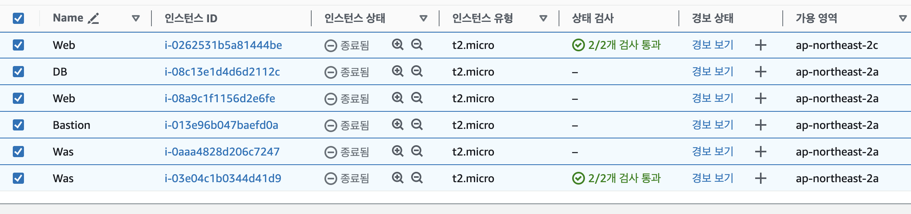
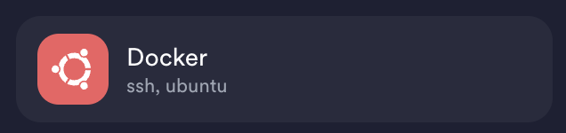
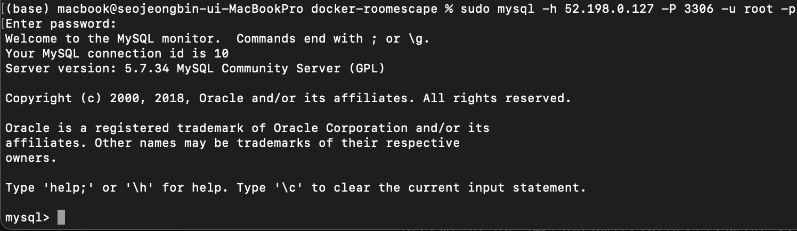

# 인프라 스터디 4주차 정리

# 도커 컨테이너

도커 이미지를 실행한 상태
이미지의 목적에 맞는 파일이 들어있는 파일 시스템 + 격리된 시스템 자원 및 네트워크 사용 가능한 독립 공간 생성
이 컨테이너는 읽기 전용인 이미지에 변경 사항을 저장하는 컨테이너 계층에 저장
도커 이미지는 붕어빵 틀 → 도커 컨테이너는 그 틀에 재료를 넣고 만드는 붕어빵
여기서 **도커 이미지를 변경**해도 **이미 실행 중인 도커 컨테이너에는 영향 X**

# 도커 명령어

- docker (container) create → 컨테이너 생성 / 자동 시작 X
  —name을 사용하지 않으면 임의의 이름 부여
- docker ps = docker container ls → 실행중(올려져있는) 컨테이너들의 목록을 확인
  -a 옵션을 함께 써주면 실행 중이지 않은 컨테이너를 포함하여 전체 컨테이너 목록을 출력

- CONTAINER ID : 컨테이너에 할당한 고유 ID → 12자리만 출력
  IMAGE : 컨테이너를 생성할 때 사용된 이미지
  COMMAND : 컨테이너 시작될 때 실행한 명령어(맨 끝에 새로운 명령어 입력으로 대체 가능)
  CREATED : 컨테이너 생성 후 경과 시간
  STATUS : 컨테이너 상태 / Up = 실행, Exited = 종료, Pause = 일시 중지
  PORT : 컨테이너 개방한 포트와 호스트 연결된 포트
  NAMES : 컨테이너 만들 때 지정한 이름
- docker start → 컨테이너 시작(생성한 컨테이너 시작)
  docker stop → 실행 중인 컨테이너 종료
  docker run → 컨테이너 시작 후 COMMAND를 실행
  로컬에 이미지 존재시 실행, 없으면 도커 허브 다운 후 실행 → 즉 **create + start**
- docker —restart를 이용하여 자동으로 재시작도 가능
  ex) docker run -it —name test —restart always centos
  → exit를 실행하여 종료하여도 다시 시작
- docker logs → 로그를 다양한 방식으로 출력할 수 있음
- docker stats → 동작 중인 컨테이너의 상태 및 리소스의 양 확인 가능

- MEM USAGE / LIMIT : 메모리 사용량 및 컨테이너에서 사용가능한 메모리 제한
  NET I/O : 네트워크 I/O
  BLOCK I/O : 블록 I/O
  PIDS : 사용중인 PID(Process의 수)
- docker rm → 컨테이너 삭제(종료된 컨테이너만 삭제 가능)

# 이미지 레이어

레이어는 기존 이미지에 추가적인 파일이 필요할 때 해당 파일만 추가하는 것

위처럼 이미 ubuntu 이미지가 기존에 존재하고, nginx 이미지를 다운받으면 상단에 있는 nginx 레이어만 다운
Docker 이미지는 위 그림처럼 여러 레이어로 구성, 각 레이어는 이전 레이어의 변경 사항을 가짐
이 여러 개의 레이어에는 읽기 전용인 Read Only 레이어 + 새로 변경 및 추가된 새로운 레이어로 구성
→ 비교하자면 Git 레포에서 commit 로그를 쌓는 것과 같음!

레이어 개념이 추가되며 새로 업데이트 된 내용만 담는 레이어가 쌓는 개념으로 관리하므로 효율적
업데이트 된 부분만 이미지로 생성, 기존 이미지를 바뀐 부분과 조합하기에 이미지 큰 변화 X
→ Git 레포에서 pull을 땡기는 것과 같음

이미지를 실행하여 도커 컨테이너 생성시에도 레이어 방식을 이용
컨테이너 생성시 기존의 읽기 전용 이미지 레이어 위 읽기/쓰기 전용 레이어를 추가
이는 컨테이너가 실행되며 생성하는 모든 파일 및 변경사항은 읽기/쓰기 전용 레이어 저장
→ 여러 개의 컨테이너를 실행하지만 기존에 있는 이미지는 불변성을 유지함

## 레이어의 특징

- 레이어 격리 : 각 레이어는 독립적인 파일 시스템 → 각 레이어의 애플리케이션 + 종속성 변경 사항만 포함
- 레이어 재사용 : 동일 레이어를 여러 이미지 공유 가능 → 이미지 빌드 시간 및 저장소 사용량 감소
- 레이어 버전 관리 : 레이어 생성시마다 새로운 버전 생성 → 이전 레이어 유지로 변경이력 관리 가능
- Dockerfile 기반 레이어 생성 : Dockerfile에서 작성된 명령어들이 각각 실행될 때마다 새로운 레이어 생성 → 이런 애플리케이션과 그에 상응하는 설정, 라이브러리, 종속성 등의 변경 사항 추적 가능

## 작동 원리

1. Docker 이미지 생성시 Dockerfile을 사용하여 이미지 레시피를 정의
2. Dockerfile에 기술된 명령어들이 순서대로 실행
3. 각 명령어 실행시 새로운 레이어 생성, 변경 사항이 레이어 저장
4. Docker 이미지 실행시, 해당 이미지의 모든 레이어가 연결 → 전체 파일시스템을 구성
   실행된 컨테이너는 모든 레이어의 데이터에 액세스 가능
5. 컨테이너 내의 변경해 저장한 것은 컨테이너의 최상단 레이어에 저장 → 이미지 레이어에는 영향 X(불변성)

## 이미지 생성 방법

여러가지 명령어를 토대로 Dockerfile을 작성 후 빌드하면 나열된 명령문을 차례로 수행해 DockerImage 생성
Dockerfile은 레이어 개념으로 실행되기 때문에 레이어 순서대로 작성하는게 좋음

From → 베이스 이미지를 지정, 생성할 이미지의 베이스가 될 이미지를 의미(없으면 허브에서 가져옴)
ex) FROM ubuntu:18.04

LABEL → 이미지에 메타데이터 추가(key-value)
ex) LABEL “purpose” = “practice”

RUN → 새로운 레이어에서 명령어 실행, 새로운 이미지 생성(1 RUN 1 IMAGE)
ex) RUN apt-get update / RUN apt-get install apache2 -y(-y를 쓰는 걸 권장한다고 함)

WORKDIR → 작업 디렉토리 지정, 없으면 생성 / 지정시 이후 명령어는 해당 디렉토리 기준 동작(cd 명령어)
ex) WORKDIR /home/app/

EXPOSE → Dockerfile의 빌드로 생성된 이미지에서 열어줄 포트 의미
호스트 ↔ 컨테이너의 포트 매핑 시 사용 / 컨테이너 생성 시 -p 옵션의 컨테이너 포트 값으로 EXPOSE 값 서술
ex) EXPOSE 80

ADD → 로컬 파일을 이미지에 추가, 추가 파일이 압축파일이면 알아서 풀어서 추가
ex) ADD test.html /home/app/html

COPY → ADD와 차이점은 일반 파일만 가능, 특수 파일 아니면 COPY를 사용
ex) COPY [hello.java](http://hello.java) /home/app/hello.java

CMD → 컨테이너 시작 시 실행할 명령어, 한 번만 사용 가능
ex) CMD apachectl -DFOREGROUND / 계속 실행을 유지하게 해줌

USER → 이미지를 어떤 계정에서 실행하는지 지정 / 기본적으로 root에서 진행

## 빌드 및 실행

dockerfile 빌드
docker build -t {이미지명 : 버전명} {작성한 도커파일 경로}
docker build -t testimg . → 현재 위치에서 testimg를 의미
ex) sudo docker build --platform linux/amd64 -t duehee/roomescape_new .

빌드 이미지 실행
docker run -p {입력포트}:{컨테이너 포트} {컨테이너명}
docker run -p 8080 : 80 test-container
ex) sudo docker run --platform linux/amd64 -d -p 8080:8080 duehee/roomescape_new

# 도커 컴포즈

여러 개의 Docker 컨테이너들을 하나의 서비스를 정의하고 구성해 하나의 묶음으로 관리할 수 있는 하나의 앱 만드는 것

컴포즈를 사용하기 위해선..

- Docker Compose 파일 작성 : YAML 형식으로 작성된 Docker Compose 파일을 사용해 서비스 관련 설정 정의
- Docker Compose 실행 : docker-compose up 명령어 사용해 도커 컴포즈 정의 서비스 시작
- 실행 및 관리 : 실행된 서비스를 확인하고 관리하기 위해 docker-compose ps, docker-compose logs, docker-compse exec등 명령어 사용
- 중지 및 정리 : 작업을 완료한 docker-compose down 명령어 사용해서 Docker Compose 파일에 정의된 서비스들을 중지하고 관련 컨테이너들을 삭제

docker compose를 사용하지 않으면 각각의 컨테이너를 따로 실행해야해서 번거로움
→ 이를 사용한 경우는 아래와 같음

version: ‘3’
    
services:
    web:
        build: .
    image: “springbootapp:latest”
    ports:
        - “8080:8080”
    depends_on:
        - db
    enviroment:
        SPRING_DATASOURCE_URL: jdbc:mysql://db:3306/mydb
        SPRING_DATASOURCE_USERNAME: root
        SPRING_DATASOURCE_PASSWORD: mysecretpassword

    db:
        image: “mysql:8.0”
        ports:
            - “3306:3306”
        enviroment:
            MYSQL_ROOT_PASSWORD: mysecretpassword
            MYSQL_DATABASE: mydb
이렇게 코드를 작성한 의미를 알아보면

- version → Docker Compose 파일 버전
- services: Docker Compose에서 관리할 서비스 목록 정의
- web : 첫 번째 서비스로 자바 웹 애플리케이션을 포함한 Spring Boot 이미지 사용
- build : 이미지를 빌드할 디렉터리 지정(.은 해당 파일 존재 디렉토리)
- image : 빌드한 이미지 이름 지정
- ports : 호스트와 컨테이너 포트 매핑(여긴 호스트 8080 / 컨테이너 8080 연결)
- depends_on : MySQL DB 쓸거니 db 명시
- environment : 필요 환경 변수 지정(Spring boot의 데이터 소스 정보 설정)
- db : 두 번째 서비스, MySQL DB 이미지 사용
- image : MySQL 이미지를 사용, 버전은 8.0 사용
- ports : 호스트와 컨테이너 간 포트 매핑(여긴 호스트 3306 / 컨테이너 3306 연결)
- enviroment : 필요한 환경 변수 지정(MySQL의 사용자 정보와 이름 설정)

→ Spring Boot와 MySQL이 연결된 멀티-컨테이너 환경 구동 → 훨씬 간편!

# 실습 내용
실습을 하면서 캡처 했어야 하는데, 실수했네요

기존에 3tier 띄워보겠다고 올려놓은 모든 인스턴스를 정리했다

새로운 인스턴스를 생성했다(도쿄인데, 이유는 한국 서브넷 밀다가 기본 서브넷도 밀어버렸다)

Termius를 이용해서 연결했다

처음으로 서버에 접근하면 sudo apt update를 이용하여 업데이트를 진행한다

apt-get install apt-transport-https ca-certificates curl gnupg-agent software-properties-common // curl -fsSL https://download.docker.com/linux/ubuntu/gpg | sudo apt-key add -
→ https 저장소 사용 및 Docker 저장소 키를 apt에 저장하도록 했다

add-apt-repository "deb [arch=amd64] https://download.docker.com/linux/ubuntu $(lsb_release -cs) stable"
→ 안정성 있는 도커 버전 사용을 위해 위 코드를 작성했다
이후 apt update

apt-cache policy docker-ce
apt install docker-ce
→ docker 엔진을 추가적으로 설치, 이후 systemctl status docker로 실행을 확인한다

다음으로는 MySQL을 EC2에 다운받았다
docker pull mysql:5.7.34
→ 특정 버전인 5.7.34를 다운로드했다 / 버전 안 적으면 가장 최근것 다운로드(latest)

이 mysql이 잘 연결되었는지 한 번 확인해보기 위해 로컬에서 접속을 진행했다

성공!

기존에 3tier 띄워보겠다고 올려놓은 모든 인스턴스를 정리했다(빨리 끌 걸 그랬다 내 15달러)

docker 사용을 위해 띄워 놓은 각 컨테이너 상태

현재 mysql의 버전을 5.7과 8.0을 띄워놨는데, 서버부터 띄워보자! 하는 마음에 다 같이 올려놨음
지금 mysql 5.7버전과 duehee/roomescape_new를 연결하고자 했는데, 로컬 환경에서 DB 오류로 실행이 안되어서..? 다시 파일을 수정해서 올려야 할 것 같음

용량 초과, 아이디 인증 오류, jdk 오류, arm/amd 오류 등.. 다양한 오류를 만나서 시간이 좀 오래 걸린 듯
→ 도커 컴포즈를 이용하지 않아서 더욱 많은 시간이 소요된 듯, 다음주에 도커 스웜 학습 전 서버가 열리는 지 확인하고 실습을 준비하는 것이 좋을 거 같음
얼른 서버 띄워보겠습니당

도커 컴포즈 코드 작성

version: '3.8'

services:
    app:
        image: duehee/roomescape_new 
    ports:
        - "8080:8080"
    depends_on:
        - mysql_old 
        - mysql_new
    environment:
        SPRING_PROFILES_ACTIVE: docker 

    mysql_old:
        image: mysql:5.7.34 
        container_name: mysql-old
        environment:
            MYSQL_ROOT_PASSWORD: tjtjddl12
        ports:
            - "3306:3306"
        volumes:
            - mysql-old-data:/var/lib/mysql

    mysql_new:
        image: mysql:8.0.17
        container_name: mysql-new
        environment:
            MYSQL_ROOT_PASSWORD: tjtjddl12
        ports:
            - "3307:3306"
        volumes:
            - mysql-new-data:/var/lib/mysql

    volumes:
        mysql-old-data:
        mysql-new-data:
