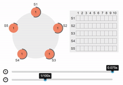

# 인프라 스터디 5주차 정리

# 도커 스웜

도커 스웜(Docker Swarm)은 도커 컨테이너를 위한 *클러스터링, 스케줄링틀
* 클러스터링 : 무리를 이룬다 → 비슷한 데이터끼리 묶어놓는 것
  여러 개의 서버와 컨테이너 관리를 쉽게 할 수 있도록 도와줌
  여러 대의 Docker 호스트들을 하나인 것 처럼 만들어주는 *오케스트레이션 도구
  쿠버네티스와 대표되는 오케스트레이션 툴 // 도커는 고래 한 마리, 도커 스웜은 고래 여러마리
* 오케스트레이션 : 여러 IT 자동화 태스크 또는 프로세스를 조정하여 실행하는 것

# 도커 스웜 용어 정리

아래 나오는 Gossip network는 뭘까?
→ 각 노드가 주기적으로 TCP/UDP 기반으로 메타데이터를 주고 받으며 데이터를 전송 / 아주 가볍기에 도커에서 사용함

1. 노드(Node)
   텍스트 클러스터에 속한 도커의 서버 단위
   보통 한 서버에 하나의 *도커 데몬을 실행하기 때문에 노드 = 서버로 이해하면 편함
* 도커 데몬 : API 요청 수신 및 이미지/컨테이너/네트워크 같은 도커의 객체들을 관리
2. 매니저(Manager)
   클러스터의 상태를 관리 / 매니저 노드에서만 명령어 실행 가능(관리자)
   아키텍처상 매니저는 고가용성을 위해 여러대 실행 → 일반적으로 노드마다 매니저 배포

하는 일
1. 클러스터 상태 유지 : *뗏목 알고리즘 사용(*뗏목 알고리즘은 아래서 따로 다룸)
2. 스케줄링 서비스 : 작업자 노드에게 컨테이너 배포 / 특정 노드 or 전체 노트 배포 가능
3. 스웜 모드 제공(아래에서 따로 다룸)
3. 작업자(Worker)
   도커에서 일반적으로 컨테이너를 실행하는 노드
   매니저의 명령을 받아 컨테이너를 생성 및 헬스 체크 실시(매니저 일 안 맡음)
   서비스 규모에 맞게 많이 실행하고, 요청이 많아지면 작업자를 *스케일아웃함
* 스케일아웃 : 서버를 여러 대 추가해 시스템을 확장하는 것(로드밸런싱 필수)

작업자 노드들의 클러스터는 반드시 하나 이상의 관리자 노드를 가짐(매니저도 작업자에 속함)
단일 매니저를 둔 노드 클러스터에서도 “docker service create”로 도커 스웜 실행 가능

도커 스웜 실행시 매니저 노드가 작업자 노드가 하는 일을 시키지 않기 위한 설정도 가능
drain 상태로 만들면 active인 노드에게만 task를 할당
”docker node update” / “docker node inspect” → 각 Drain, Active 명령어
4. Service Discovery
   서비스 디스커버리는 컨테이너의 실행 위치와 상태를 제공(자체 DNS 서버 보유)
   컨테이너를 생성하면 서비스명과 동일한 도메인 등록, 멈추면 도메인 제거
   외부 서비스 의존도가 낮아지고 스웜의 내부에서 자체 처리 가능(AWS의 *IAM)
* IAM → AWS 리소스에 대한 액세스를 안전하게 제어할 수 있는 웹 서비스

5. Service
   기본적인 배포 단위, 하나의 서비스는 하나의 이미지를 기반으로 생성하고 동일 컨테이너 하나 이상 실행 가능
   → 최종적인 배포 서비스는 여러개의 task로 구성

6. Task
   컨테이너 배포 단위, 각각의 테스트가 컨테이너를 관리하며 개별 도커 컨테이너를 의미
   컨테이너를 실행할 때 명령어도 포함

## 뗏목 알고리즘

여러 서버 중 일부 서버에 장애가 생겨도 제 기능을 유지하도록 하는 합의 알고리즘

### 합의 알고리즘

- 다수의 참여자들이 동일된 의사 결정을 하기 위해 사용되는 알고리즘
- 한 서버에서 명령을 실행하기 위해 다른 서버에 합의 요청 → 문제 없으면 동일 상태를 유지하게 함

### 장애 허용 분산 시스템

- 시스템 중 일부에 오류가 발생해도 정상적으로 작동할 수 있도록 하는 시스템
- 뗏목 일부 나무가 손상되어도 제 기능을 실행 함

### 동작 원리

- 로그
1. 시스템의 처리 내용과 이용 상황을 시간 흐름에 따라 기록
2. 로그에 있는 명령을 합의하는 데 사용
- 상태 시스템
1. 각 상태를 조건에 따라 연결해 놓은 것
2. 어떤 조건이 총족되거나 이벤트가 발생하면 현재 상태에서 다음 상태로 이동하는 동작을 수행
3. 각 상태 시스템은 로그로부터 입력받음
4. 상태 시스템은 오류를 허용하려는 특징 → 여러 서버 중 특정 서버에 장애가 생겨도 클라이언트는 정상 작동하는 다른 상태 시스템과 상호작용 할 수 있음
- 먼저 한 서버가 명령을 실행할 때 명령을 실행해도 되는지 다른 서버에게 합의를 구함
  → 합의를 한 서버는 같은 명령을 실행하고 동일 상태를 유지, 이미 합의를 한 서버는 명령 실행을 위해 다시 합의를 구할 필요가 없음
- 오류가 발생한 서버가 절반 이상이면 해당 명령의 진행은 중단, 명령으로 인한 잘못된 결과는 반환하지 않음

### 뗏목 알고리즘 시나리오

- 모든 서버가 정상적으로 작동
  → 한 서버가 어떤 조건이 충족되어 로그 명령을 적용하여 다른 서버에게 합의를 요청 / 다른 모든 서버는 해당 명령에 합의하고 해당 명령을 수행하여 모두 동일 상태 유지

- 일부 서버에 장애가 발생한 경우
  → 일부 서버에만 장애가 발생할 경우, 장애가 생긴 서버는 합의를 할 수 없기에 명령을 수행하지 못한채 그대로 남게 되고, 합의한 서버들이 해당 명령을 수행하여 장애가 발생한 서버를 제외하고는 모두 동일한 상태를 유지

- 절반 이상의 서버에 장애가 발생한 경우
  → 장애가 발생한 서버가 절반 이상일 경우, 합의를 요청해도 결과 반환 X,  때문에 합의를 요청한 서버는 다음 로그로 넘어가면서 다른 서버들에데 계속 합의를 요구함

### 도커 스웜에서의 활용

- 도커 스웜에서는 매니저 노드의 절반 이상이 장애 발생한 경우, 장애가 생긴 매니저 노드 복구시까지 클러스터의 운영을 중단함
- 만약 매니저 노드 사이에 네트워크 파티셔닝과 같은 현상 발생시, 짝수 개의 매니저로 구성한 클러스터는 운영이 중단 될 수도 있지만 홀수 개로 했을 경우 과반수 이상이 유지되는 *쿼럼 매니저 운영 가능
* 쿼럼 : 분산 시스템에서 작업을 수행하기 위해 분산 트랜잭션이 얻어야 하는 최소 투표 수
- 따라서 매니저 노드는 가능한 한 홀수 개로 구성하는 것을 권장

## 스웜 모드

하나의 호스트 머신에서 도커를 굴리다가 자원이 부족하면 어떻게 할 것인가?
→ 매우 성능이 좋고 디스크 용량이 큰 좋은 서버를 새로 산다. 지만 비싸다.
이를 여러 대의 서버를 클러스터로 만들어 병렬 확장 시키는 것으로 해결

이에 따라 도커에서는 도커 스웜과 스웜 모드를 지원

### 스웜 클래식

도커 버전 1.6부터 사용 가능한 컨테이너로서의 스웜
여러 대의 도커 서버를 하나의 지점에서 사용하도록 단일 접근점을 제공
Docker run, Docker ps 등 일반적인 도커 명령어와 API로 클러스터 서버 제어 및 관리

### 스웜 모드

도커 버전 1.12부터 사용가능한 도커 스웜 모드
마이크로서비스 아키텍처의 컨테이너를 다루기 위한 클러스터링 기능에 초점
같은 컨테이너를 동시에 여러 개 생성해 필요에 따라 유동적으로 컨테이너의 수를 조절 가능
”로드 밸런싱” 자체적인 지원
→ 서비스 확장성이나 안정성 등 여러 측면에서 스웜 클래식보다 뛰어남

### 차이점

*분산 코디네이터, *에이전트와 같은 클러스터 툴이 별도로 구동되느냐?
여러 개의 도커 서버를 하나의 클러스터로 구성하려면 각종 정보를 저장하고, 동기화하는 분산 코디네이터, 클러스터 내의 서버를 관리하고 제어하는 매니저, 각 서버를 제어하는 에이전트가 반드시 있어야 함
스웜 클래식은 이들이 별도 실행되어야하지만, 스웜 모드는 자체적으로 다 내장되어있음
→ 스웜 모드를 사용한다면 더욱 쉽게 서버 클러스터를 구현 가능!
* 분산 코디네이터 : 클러스터에 영입할 새로운 서버 발견, 클러스터 설정 저장, 데이터 동기화에 사용
* 에이전트 : 클러스터 내의 각 노드에서 실행되는 프로그램 / 프로세스 → 매니저 노드와 통신함

### 스웜 모드의 구조

위에서 말한 것처럼 이 친구도 매니저 노드와 워커 노드로 구성
워커 노드 : 실제로 컨테이너가 생성되고 관리되는 도커 서버
매니저 노드 : 이를 관리하는 도커 서버(노드 = 서버), 이 때 매니저 노드는 워커 노드에 포함되어 있음
매니저 노드는 1개 이상, 워커 노드는 없어도 됨(매니저는 워커의 일을 할 수 있기 때문)
매니저 노드는 1개만 사용하지만, 운영환경에서 스웜모드로 도커 클러스터를 구성하려면 매니저 노드 다중화 권장
→ 매니저 노드 부하 분산 및 특정 매니저 노드 다운 시 정상적인 스웜 클러스터 유지를 위해
→ 그렇다고 성능이 좋아지는 것은 아니니 참고(홀수 구성 추천, 위에서 말한 뗏목 알고리즘의 쿼럼)

# 오케스트레이션 툴의 사용 이유

컨테이너화된 애플리케이션의 효율적인 관리 → 컨테이너의 배포나 확장, 모니터링을 자동화하고 간소화함

1. 자동화된 배포 및 관리
   → 오케스트레이션 툴은 애플리케이션의 컨테이너를 여러 노드에 자동 배포, 필요 리소스를 자동 할당하여 수동 배포 작업의 필요성을 줄이고 배포 속도 증가에 도움을 줌
2. 확장성
   → 컨테이너의 수평적 확장(스케일 아웃) 및 축소(스케일 인)하기에 편함, 컨테이너 수 조정에 도움을 줌
3. 신뢰성 및 고가용성
   → 컨테이너와 서비스의 지속적인 모니터링으로 장애가 발생시 자동 복구 / 다른 노드 할당
4. 서비스 디스커버리 및 로드 밸런싱
   → 실행 중 서비스 자동 감지 및 로드 밸런싱으로 부하 분산 제공
5. 보안
   → 네트워크 정책이나 권한 관리, 보안 그룹을 정하여 컨테이너 간 통신과 접근을 제어함
6. 리소스 관리
   → 노드의 리소스를 최적화하여 사용, 리소스 부족 시 추가나 불필요한 리소스 삭제
7. 컨테이너 간 네트워크 관리
   → 컨테이너 간의 네트워크 자동 구성 및 관리, 서로 다른 호스트 간의 통신을 쉽게함$
