# 도커 실습

## MySQL 도커로 띄우기
- `MySQL`을 도커로 띄우기 위해서 `MySQL Image`를 `pull`받는다.
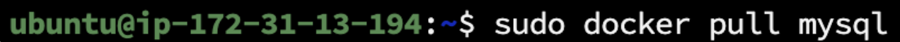
- `pull`받은 이미지를 실행시켜 컨테이너화 한다.
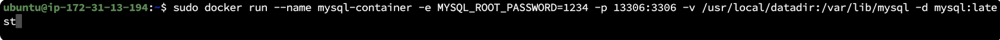
- `MySQL`컨테이너에 접속해서 DB를 생성한다.
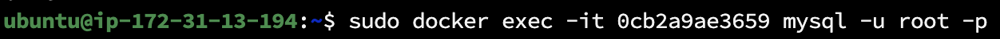

## WAS 도커로 띄우기
- `Dockerfile`을 작성해서 현재 프로젝트를 이미지로 만든다.
- `Dockerfile`을 `build`하기 전에 `sudo ./gradlew build`를 이용해서 프로젝트를 빌드한다.
- 다음과 같이 `Dockerfile`을 작성한다.
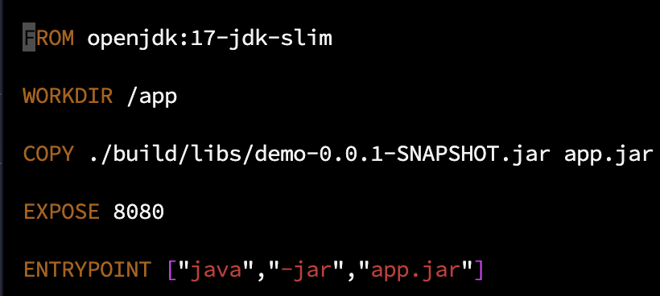
- `Dockerfile`을 `build`해서 `image`를 생성한다.

- `image`가 잘 생성되었다.
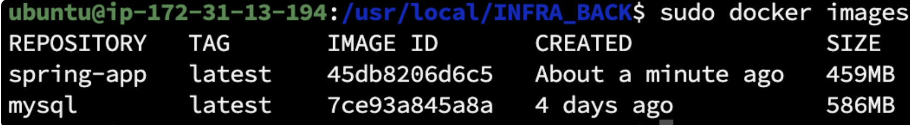
- 만들어진 `image`를 8080포트에서 실행시킨다.

- 요청을 날려보면 도커라이즈가 잘 된것을 볼 수 있다.
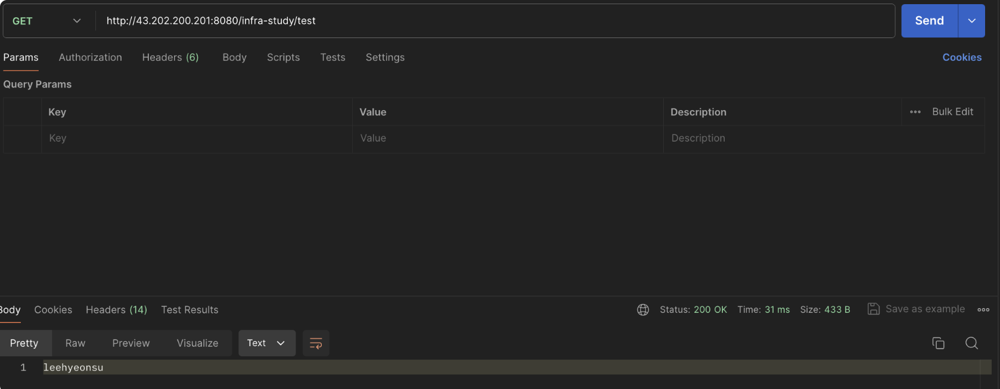
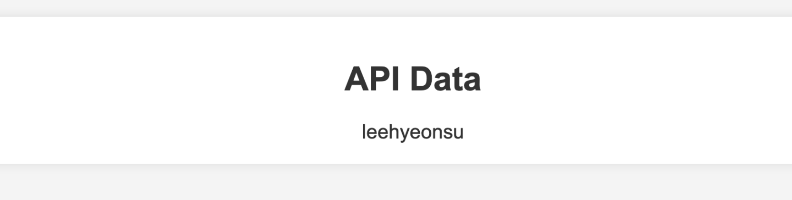
- http://43.202.200.201/


## Image, Container Layer란?
- 도커의 이미지는 Layer와 메타정보로 구성된다.
- `Image Layer`는 읽기 전용으로 `Container`를 구성할 때 이미지를 기반으로 구성한다.
- `Container Layer`는 읽기, 쓰기가 모두 가능하다.
- 즉 `Image Layer`를 이용해서 컨테이너를 구성하고 `Container Layer`는 구성한 컨테이너에서 실행되는 작업들을 읽고 쓰게 된다.
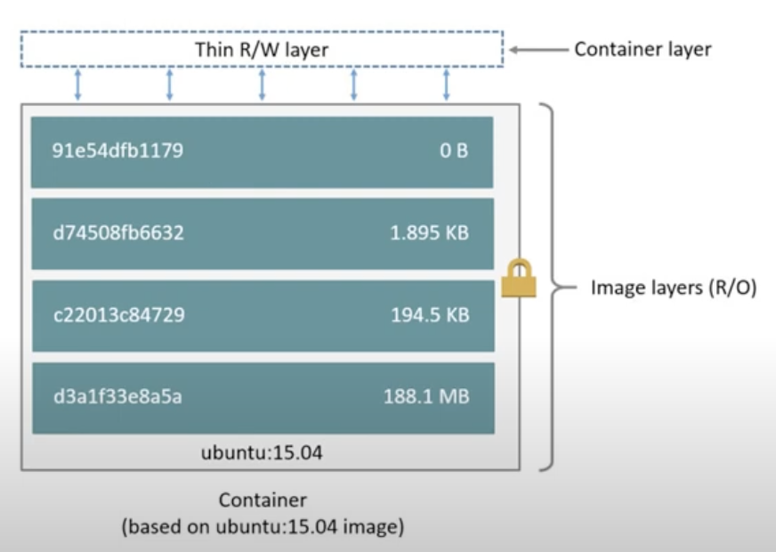

### 내가 만든 이미지 내부 확인해보기
- `sudo docker inspect spring-app`명령어를 통해 이미지 내부를 확인해볼 수 있다.
- 각각의 Layer는 sha256으로 해싱되어 있다.
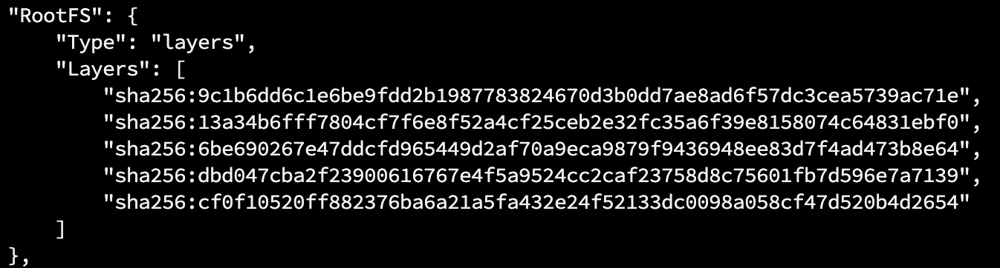
- 해싱된 파일은 다음의 디렉토리에 있다.
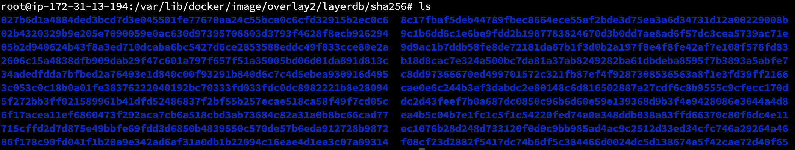
- 해싱된 디렉토리에 들어가면 실제 파일의 이름이 나와있다.
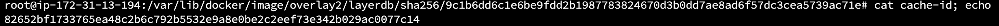
- `/var/lib/docker/overlay2`경로에 실제 이미지 레이어 파일의 디렉토리가 있는것을 볼 수 있다.


- 도커 이미지의 캐시관리
- 쓰기속성: 컨테이너 레이어
    - 컨테이너에서 작업한 내용을 저장해야하기 때문
- 읽기속성: 이미지 레이어
- 컨테이너가 생성이 되면 컨테이너 레이어가 자동으로 생성된다.
    - read, write속성을 가짐
    - 컨테이너가 삭제되면 컨테이너 레이어도 자동으로 삭제된다.

## union file system
- 여러개의 파일 시스템을 하나의 파일 시스템처럼 인식하게 하는 시스템
- 도커 컨테이너 레이어와 이미지 레이어는 따로 존재하지만 이것을 통합한 FileSystem으로 관리할 수 있게 된다.
- 이미지 Layer는 lowerdir, container Layer는 upperdir에 위치한다.
- 최종적으로 upperdir, lowerdir데이터가 merged layer에 합쳐지고 컨테이너에 마운트된다.
- upperdir, lowerdir이 같은 데이터를 작업하면 upperdir이 우선순위를 가진다.
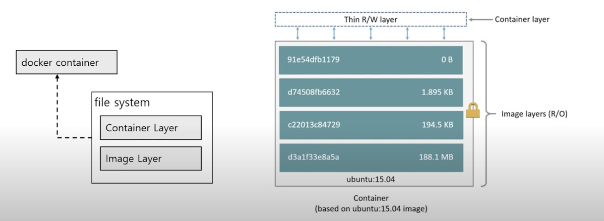
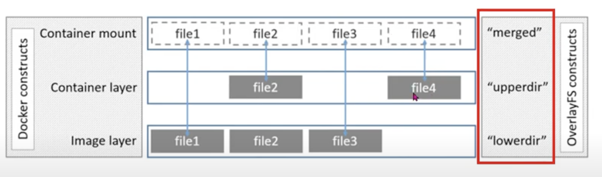
- 실행중인 컨테이너를 `docker inspect`명령어를 통해 살펴보면 다음과 같다.(lowerdir, upperdir, mergeddir이 있는 것을 볼 수 있다.)
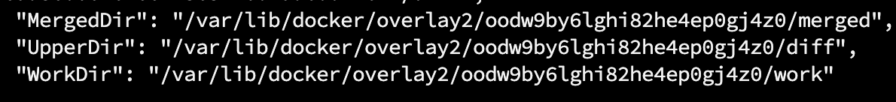


## Dockerfile 빌드시 이미지 캐싱
### 맨 처음 이미지를 빌드했을 때
```json
"Layers": [
    "sha256:9c1b6dd6c1e6be9fdd2b1987783824670d3b0dd7ae8ad6f57dc3cea5739ac71e",
    "sha256:13a34b6fff7804cf7f6e8f52a4cf25ceb2e32fc35a6f39e8158074c64831ebf0",
    "sha256:6be690267e47ddcfd965449d2af70a9eca9879f9436948ee83d7f4ad473b8e64",
    "sha256:dbd047cba2f23900616767e4f5a9524cc2caf23758d8c75601fb7d596e7a7139",
    "sha256:cf0f10520ff882376ba6a21a5fa432e24f52133dc0098a058cf47d520b4d2654"
]
```

### 다시 빌드했을 때(이전에 빌드된것을 이용함)

```json
"Layers": [
    "sha256:9c1b6dd6c1e6be9fdd2b1987783824670d3b0dd7ae8ad6f57dc3cea5739ac71e",
    "sha256:13a34b6fff7804cf7f6e8f52a4cf25ceb2e32fc35a6f39e8158074c64831ebf0",
    "sha256:6be690267e47ddcfd965449d2af70a9eca9879f9436948ee83d7f4ad473b8e64",
    "sha256:dbd047cba2f23900616767e4f5a9524cc2caf23758d8c75601fb7d596e7a7139",
    "sha256:cf0f10520ff882376ba6a21a5fa432e24f52133dc0098a058cf47d520b4d2654"
]
```

### application.yml에 텍스트 추가하고 다시 빌드했을 때(was만 새롭게 빌드함)
```json
"Layers": [
    "sha256:9c1b6dd6c1e6be9fdd2b1987783824670d3b0dd7ae8ad6f57dc3cea5739ac71e",
    "sha256:13a34b6fff7804cf7f6e8f52a4cf25ceb2e32fc35a6f39e8158074c64831ebf0",
    "sha256:6be690267e47ddcfd965449d2af70a9eca9879f9436948ee83d7f4ad473b8e64",
    "sha256:dbd047cba2f23900616767e4f5a9524cc2caf23758d8c75601fb7d596e7a7139",
    //새로운 이미지 레이어로 교체됨
    "sha256:4895ae92a727102409ae7ae44f76e97f1d7eed4a8f0a165c1a7baa6d0bf037ef"
]
```

### WAS빌드만 다시하고 다시 이미지 빌드했을 때(기존의 캐시 그대로 사용)
```json
"Layers": [
    "sha256:9c1b6dd6c1e6be9fdd2b1987783824670d3b0dd7ae8ad6f57dc3cea5739ac71e",
    "sha256:13a34b6fff7804cf7f6e8f52a4cf25ceb2e32fc35a6f39e8158074c64831ebf0",
    "sha256:6be690267e47ddcfd965449d2af70a9eca9879f9436948ee83d7f4ad473b8e64",
    "sha256:dbd047cba2f23900616767e4f5a9524cc2caf23758d8c75601fb7d596e7a7139",
    //기존 이미지 레이어 이용
    "sha256:4895ae92a727102409ae7ae44f76e97f1d7eed4a8f0a165c1a7baa6d0bf037ef"
]
```

### 캐싱옵션을 끄고 이미지 빌드

```json
"Layers": [
    "sha256:9c1b6dd6c1e6be9fdd2b1987783824670d3b0dd7ae8ad6f57dc3cea5739ac71e",
    "sha256:13a34b6fff7804cf7f6e8f52a4cf25ceb2e32fc35a6f39e8158074c64831ebf0",
    "sha256:6be690267e47ddcfd965449d2af70a9eca9879f9436948ee83d7f4ad473b8e64",
    "sha256:dbd047cba2f23900616767e4f5a9524cc2caf23758d8c75601fb7d596e7a7139",
    //이것만 새로 빌드됨
    "sha256:5fa7cf92a36799d6467ef5a28bab7471cc8bb6e4a4f89679b2a296b0f7ff16cc"
]
```
#### `--no-cache`옵션을 켜도 마지막줄만 새로 빌드하는 이유
- 레이어 캐싱: 도커는 각 레이어의 변경 사항을 추적하여 최적화한다. 변경되지 않은 명령어와 파일 시스템 상태는 동일한 해시를 유지한다.

- 변경되지 않은 단계: Dockerfile에서 COPY 명령으로 복사된 파일만 변경되면 해당 레이어의 해시만 변경된다. 나머지 명령어가 변경되지 않으면 다른 레이어의 해시는 동일하게 유지된다.
