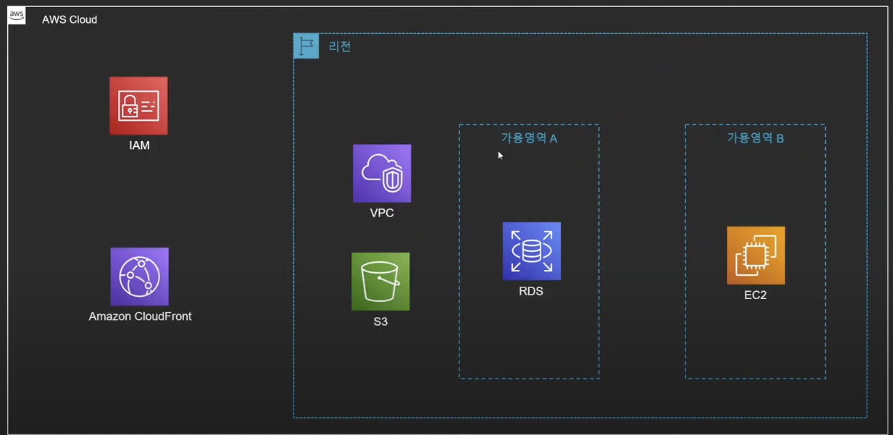
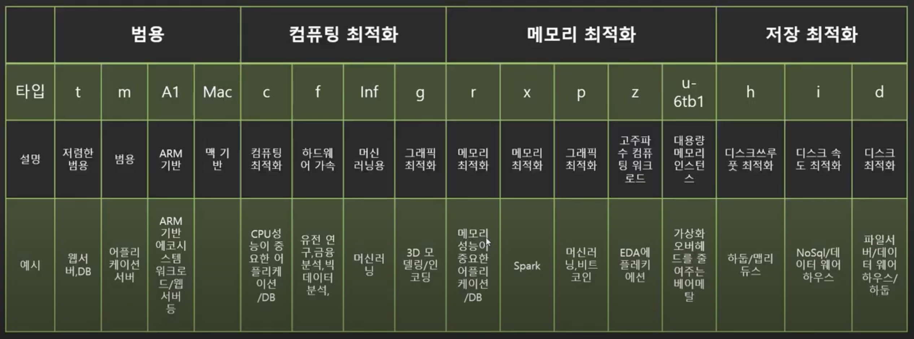
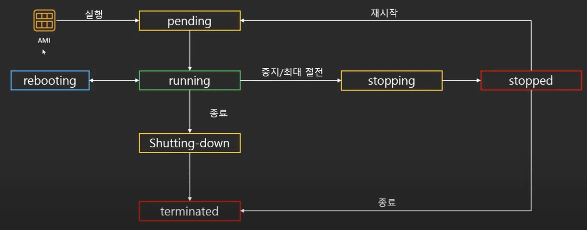
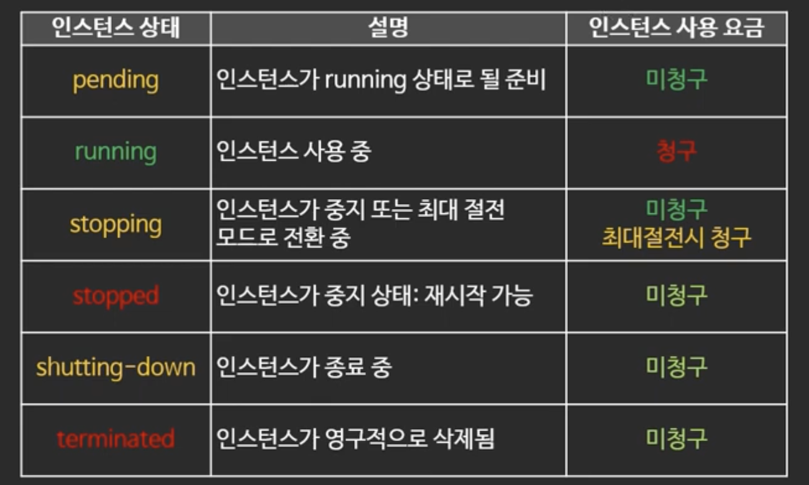

# AWS

## 온디맨드와 온프로미스
- 온디맨드: 클라우드 공급자가 모든 물리적 및 가상의 미들웨어, 하드웨어, 소프트웨어, 데이터베이스 및 기타 지원 인프라를 조달
- 온프로미스: 회사에서 직접 데이터센터를 만들어서 운영하는 인프라 구축 방식

## 클라우드 컴퓨팅 모델
클라우드 컴퓨팅 모델은 Network, Storage, Computing, OS, APP여부에 따라서 아래와 같이 모델을 나눌 수 있다.
- Iaas(Infrastructure)
    - 제공: Network, Storage, Computing
    - 인프라만 제공
    - OS를 직접 설치하고 필요한 소프트웨어를 개발해서 사용
    - 예시: AWS ec2
- PaaS(Platform as a Service)
    - 제공: Network, Storage, Computing, OS + Runtime(앱을 실행하기 위한)
    - 바로 코드만 올려서 돌릴 수 있도록 구성
    - 예시: Firebase, Google App Engine
- SaaS(Software as a Service)
    - 제공: Network, Storage, Computing, OS, APP
    - 서비스 자체를 제공
    - 다른 세팅 없이 서비스만 이용
    - 예: gmail, Dropbox, Slack, Google Docs

## 클라우드 컴퓨팅 배포 모델
- 공개형(클라우드)
    - 모든 부분이 클라우드에서 실행
    - 낮은 비용
    - 높은 확장성
- 혼합형(하이브리드)
    - 폐쇠와 공개형의 혼합
    - 폐쇠형에서 공개형으로 전환하는 과도기에 사용
    - 혹은 폐쇠형의 백업으로 사용
- 폐쇠형
    - 높은 수준의 커스터마이징 가능
    - 초기 비용이 비쌈
    - 유지보수 비용이 비쌈
    - 높은 보안

## AWS의 구조
### 리전
- 지역으로 나누어져 있다.
- 물리적인 거리가 지연 속도에 영향을 미친다.
- 법률적인 문제가 있을 수 있다.(미국에서만 사용 가능한 이미지를 서울 리전에 저장하면?)
- 사용 가능한 AWS서비스가 리전에 따라 다르다.
### 가용영역
- 하나의 리전에 적어두 2개 이상의 가용영역이 존재한다.
- 리전간의 연결은 매우 빠른 전용 네트워크로 연결
- 하나 이상의 데이터센터로 구성
- 반드시 물리적으로 떨어져 있음
    - 여러 재해에 대비하기 위해서
    - 모든 AZ는 서로 100Km이내의 거리에 위치
- 같은 가용영역을 설정해도 실제로는 랜덤하게 배치된다.(한 가용영역에 몰리는 것을 방지)
### 엣지 로케이션 CloudFront(CDN)
- 여러 서비스들을 빠른 속도로 제공(캐싱)하기 위한 거점
- 전 세계 여러 장소에 흩어져 있다.
### 글로벌 서비스와 리전 서비스
- 글로벌 서비스: CloudFront, IAM, Route53, WAF
- 지역 서비스: 대부분의 서비스, S3

## AWS 유저
### 루트 유저
- 생성한 계정의 모든 권한을 자동으로 가지고 있음
- 탈취당했을때 복구가 매우 힘들다.
- 루트는 IAM유저를 관리하는 용도로만 사용(매니저 노드구만)
- AWS API 호출 불가
### IAM 유저
- 기본 권한 없음
- AWS API호출 가능
- 사용자, 그룹, 정책, 역할을 부여할 수 있다.

## 가상화
> 3개의 서비스를 각각 실행하기 위해 3개의 컴퓨터가 필요하다고 할 때 가상화를 하면 하나의 컴퓨터로 3개의 서비스를 실행할 수 있다.
### 1세대 완전 가상화(Fully Emulated)
- 모든 시스템 요소가 애뮬레이터 안에서 돌아감
- CPU, 하드디스크, 마더보드 등 모든 요소를 애뮬레이터로 구현하여 OS와 연동
- 엄청나게 느리다.
### 2세대 Paravirtualization
- Guest OS는 하이퍼바이저와 통신한다.

### 3세대 Hardware Virtual Machine(HVM)
- 하드웨어에서 직접 가상화를 지원
- 직접 Guest-OS와 하드웨어와 통신 = 빠른 속도
- AWS에서는 HVM을 이용해서 가상화하여 서비스를 제공한다.

## EC2
- 사용한 만큼 비용을 지불하는 온디맨드 방식이다.
- EC2의 가격모델은 EBS완는 별도
- EBS는 사용한 만큼 지불
- 기타 데이터 통신 비용은 별도로 청구(AWS는 AWS밖으로 나가는 트래픽에 대해서만 요금을 청구) 
### EC2의 가격 정책
- 가격: 스팟 < 예약 < 온디맨드 < 전용 호스트
#### On-Demand
- 실행하는 인스턴스에 따라 초당 비용 지불
#### Spot Instance
- 경매 형식으로 저렴하게 사용하는 방식
- 최대 90%정도 저렴
- 내가 설정한 가격보다 저렴해지면 사용할 수 있지만 비싸지면 자동으로 반납된다.
- 클러스터링 환경에서 사용하면 적절할듯
#### 예약 인스턴스(Reserved Instance-RI)
- 미리 일정 기간(1~3년)약정해서 쓰는 방식
- 최대 75%정도 저렴
#### 전용 호스트(Dedicated)
- 실제 물리적인 서버를 임대하는 방식
### EC2의 유형과 크기
- EC2에서는 여러가지 유형의 인스턴스가 존재한다. 필요에 따라서 선택해서 사용하면 된다.
- BCSD에서는 t타입을 사용하고 있다.
> 최근 AI코드리뷰 도입을 하기 위해 실제 모델을 실행해보는건 어떨까? 생각해서 필요한 인스턴스를 찾아봤는데 AI연산을 위해서는 그래픽카드가 중요하고 P타입을 사용해야한다고 한다. 그런데 대충 계산해 보니 제일 싼게 한달에 200만원..

### EC2의 생명주기

#### 중지
- 중지중에는 비용 미청구(단 EBS요금은 청구)
- 중지 후 재시작 시 퍼블릭 IP 변경
- EBS를 사용하는 인스턴스만 중지 가능

#### 재부팅
- 재부팅시에는 퍼블릭 IP 변동 없음

#### 최대 절전 모드
- 메모리 내용을 보존해서(하드디스크에) 재시작시 중단지점에서 시작할 수 있는 정지모드

#### 상태에 따른 비용 청구 여부

> 이번주는 여러가지 이슈로 인해서 AWS기초 강좌 10화 까지 밖에 공부하지 못했습니다..